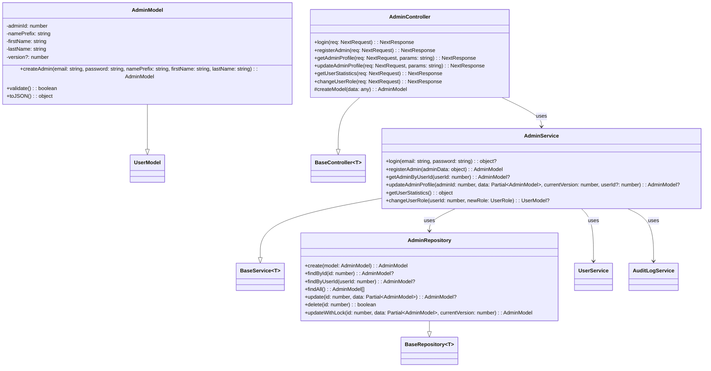

# Admin

```mermaid
classDiagram

class BaseController~T~
class BaseService~T~
class BaseRepository~T~
class UserModel
class UserService
class AuditLogService

class AdminModel {
  -adminId: number
  -namePrefix: string
  -firstName: string
  -lastName: string
  -version?: number
  +createAdmin(email: string, password: string, namePrefix: string, firstName: string, lastName: string): AdminModel
  +validate(): boolean
  +toJSON(): object
}

class AdminRepository {
  +create(model: AdminModel): AdminModel
  +findById(id: number): AdminModel?
  +findByUserId(userId: number): AdminModel?
  +findAll(): AdminModel[]
  +update(id: number, data: Partial~AdminModel~): AdminModel?
  +delete(id: number): boolean
  +updateWithLock(id: number, data: Partial~AdminModel~, currentVersion: number): AdminModel
}

class AdminService {
  +login(email: string, password: string): object?
  +registerAdmin(adminData: object): AdminModel
  +getAdminByUserId(userId: number): AdminModel?
  +updateAdminProfile(adminId: number, data: Partial~AdminModel~, currentVersion: number, userId?: number): AdminModel?
  +getUserStatistics(): object
  +changeUserRole(userId: number, newRole: UserRole): UserModel?
}

class AdminController {
  +login(req: NextRequest): NextResponse
  +registerAdmin(req: NextRequest): NextResponse
  +getAdminProfile(req: NextRequest, params: string): NextResponse
  +updateAdminProfile(req: NextRequest, params: string): NextResponse
  +getUserStatistics(req: NextRequest): NextResponse
  +changeUserRole(req: NextRequest): NextResponse
  #createModel(data: any): AdminModel
}

AdminModel --|> UserModel
AdminRepository --|> BaseRepository~AdminModel~
AdminService --|> BaseService~AdminModel~
AdminController --|> BaseController~AdminModel~

AdminController --> AdminService : uses
AdminService --> AdminRepository : uses
AdminService --> UserService : uses
AdminService --> AuditLogService : uses
```
