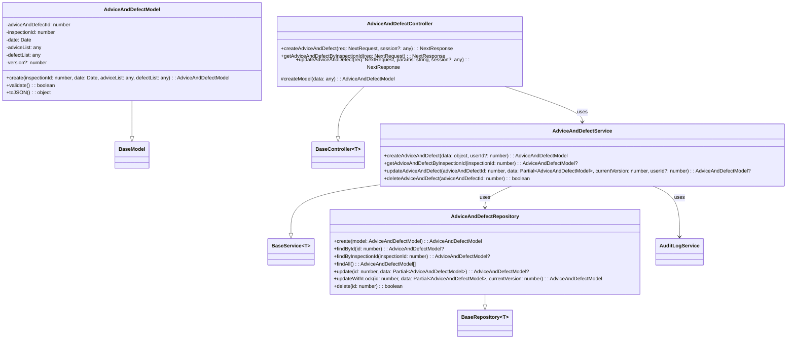

# AdviceAndDefect

```mermaid
classDiagram

class BaseController~T~
class BaseService~T~
class BaseRepository~T~
class BaseModel
class AuditLogService

class AdviceAndDefectModel {
  -adviceAndDefectId: number
  -inspectionId: number
  -date: Date
  -adviceList: any
  -defectList: any
  -version?: number
  +create(inspectionId: number, date: Date, adviceList: any, defectList: any): AdviceAndDefectModel
  +validate(): boolean
  +toJSON(): object
}

class AdviceAndDefectRepository {
  +create(model: AdviceAndDefectModel): AdviceAndDefectModel
  +findById(id: number): AdviceAndDefectModel?
  +findByInspectionId(inspectionId: number): AdviceAndDefectModel?
  +findAll(): AdviceAndDefectModel[]
  +update(id: number, data: Partial~AdviceAndDefectModel~): AdviceAndDefectModel?
  +updateWithLock(id: number, data: Partial~AdviceAndDefectModel~, currentVersion: number): AdviceAndDefectModel
  +delete(id: number): boolean
}

class AdviceAndDefectService {
  +createAdviceAndDefect(data: object, userId?: number): AdviceAndDefectModel
  +getAdviceAndDefectByInspectionId(inspectionId: number): AdviceAndDefectModel?
  +updateAdviceAndDefect(adviceAndDefectId: number, data: Partial~AdviceAndDefectModel~, currentVersion: number, userId?: number): AdviceAndDefectModel?
  +deleteAdviceAndDefect(adviceAndDefectId: number): boolean
}

class AdviceAndDefectController {
  +createAdviceAndDefect(req: NextRequest, session?: any): NextResponse
  +getAdviceAndDefectByInspectionId(req: NextRequest): NextResponse
  +updateAdviceAndDefect(req: NextRequest, params: string, session?: any): NextResponse
  #createModel(data: any): AdviceAndDefectModel
}

AdviceAndDefectModel --|> BaseModel
AdviceAndDefectRepository --|> BaseRepository~AdviceAndDefectModel~
AdviceAndDefectService --|> BaseService~AdviceAndDefectModel~
AdviceAndDefectController --|> BaseController~AdviceAndDefectModel~

AdviceAndDefectController --> AdviceAndDefectService : uses
AdviceAndDefectService --> AdviceAndDefectRepository : uses
AdviceAndDefectService --> AuditLogService : uses
```
