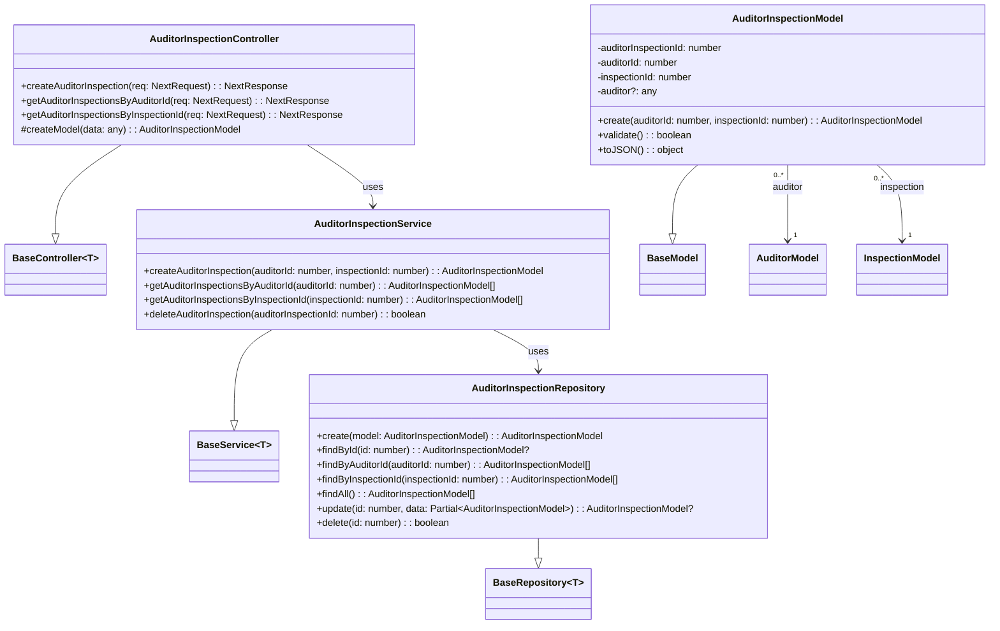

# AuditorInspection

```mermaid
classDiagram

class BaseController~T~
class BaseService~T~
class BaseRepository~T~
class BaseModel

class AuditorInspectionModel {
  -auditorInspectionId: number
  -auditorId: number
  -inspectionId: number
  -auditor?: any
  +create(auditorId: number, inspectionId: number): AuditorInspectionModel
  +validate(): boolean
  +toJSON(): object
}

class AuditorInspectionRepository {
  +create(model: AuditorInspectionModel): AuditorInspectionModel
  +findById(id: number): AuditorInspectionModel?
  +findByAuditorId(auditorId: number): AuditorInspectionModel[]
  +findByInspectionId(inspectionId: number): AuditorInspectionModel[]
  +findAll(): AuditorInspectionModel[]
  +update(id: number, data: Partial~AuditorInspectionModel~): AuditorInspectionModel?
  +delete(id: number): boolean
}

class AuditorInspectionService {
  +createAuditorInspection(auditorId: number, inspectionId: number): AuditorInspectionModel
  +getAuditorInspectionsByAuditorId(auditorId: number): AuditorInspectionModel[]
  +getAuditorInspectionsByInspectionId(inspectionId: number): AuditorInspectionModel[]
  +deleteAuditorInspection(auditorInspectionId: number): boolean
}

class AuditorInspectionController {
  +createAuditorInspection(req: NextRequest): NextResponse
  +getAuditorInspectionsByAuditorId(req: NextRequest): NextResponse
  +getAuditorInspectionsByInspectionId(req: NextRequest): NextResponse
  #createModel(data: any): AuditorInspectionModel
}

AuditorInspectionModel --|> BaseModel
AuditorInspectionRepository --|> BaseRepository~AuditorInspectionModel~
AuditorInspectionService --|> BaseService~AuditorInspectionModel~
AuditorInspectionController --|> BaseController~AuditorInspectionModel~

AuditorInspectionController --> AuditorInspectionService : uses
AuditorInspectionService --> AuditorInspectionRepository : uses

%% model relations (join table)
class AuditorModel
class InspectionModel
AuditorInspectionModel "0..*" --> "1" AuditorModel : auditor
AuditorInspectionModel "0..*" --> "1" InspectionModel : inspection
```

