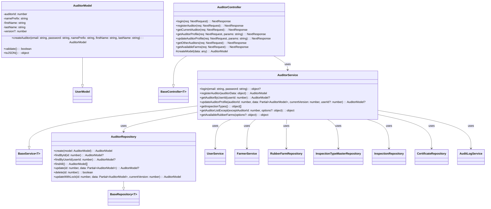

# Auditor

```mermaid
classDiagram

class BaseController~T~
class BaseService~T~
class BaseRepository~T~
class UserModel
class UserService
class FarmerService
class RubberFarmRepository
class InspectionTypeMasterRepository
class InspectionRepository
class CertificateRepository
class AuditLogService

class AuditorModel {
  -auditorId: number
  -namePrefix: string
  -firstName: string
  -lastName: string
  -version?: number
  +createAuditor(email: string, password: string, namePrefix: string, firstName: string, lastName: string): AuditorModel
  +validate(): boolean
  +toJSON(): object
}

class AuditorRepository {
  +create(model: AuditorModel): AuditorModel
  +findById(id: number): AuditorModel?
  +findByUserId(userId: number): AuditorModel?
  +findAll(): AuditorModel[]
  +update(id: number, data: Partial~AuditorModel~): AuditorModel?
  +delete(id: number): boolean
  +updateWithLock(id: number, data: Partial~AuditorModel~, currentVersion: number): AuditorModel
}

class AuditorService {
  +login(email: string, password: string): object?
  +registerAuditor(auditorData: object): AuditorModel
  +getAuditorByUserId(userId: number): AuditorModel?
  +updateAuditorProfile(auditorId: number, data: Partial~AuditorModel~, currentVersion: number, userId?: number): AuditorModel?
  +getInspectionTypes(): object[]
  +getAuditorListExcept(exceptAuditorId: number, options?: object): object
  +getAvailableRubberFarms(options?: object): object
}

class AuditorController {
  +login(req: NextRequest): NextResponse
  +registerAuditor(req: NextRequest): NextResponse
  +getCurrentAuditor(req: NextRequest): NextResponse
  +getAuditorProfile(req: NextRequest, params: string): NextResponse
  +updateAuditorProfile(req: NextRequest, params: string): NextResponse
  +getOtherAuditors(req: NextRequest): NextResponse
  +getAvailableFarms(req: NextRequest): NextResponse
  #createModel(data: any): AuditorModel
}

AuditorModel --|> UserModel
AuditorRepository --|> BaseRepository~AuditorModel~
AuditorService --|> BaseService~AuditorModel~
AuditorController --|> BaseController~AuditorModel~

AuditorController --> AuditorService : uses
AuditorService --> AuditorRepository : uses
AuditorService --> UserService : uses
AuditorService --> FarmerService : uses
AuditorService --> RubberFarmRepository : uses
AuditorService --> InspectionTypeMasterRepository : uses
AuditorService --> InspectionRepository : uses
AuditorService --> CertificateRepository : uses
AuditorService --> AuditLogService : uses
```
