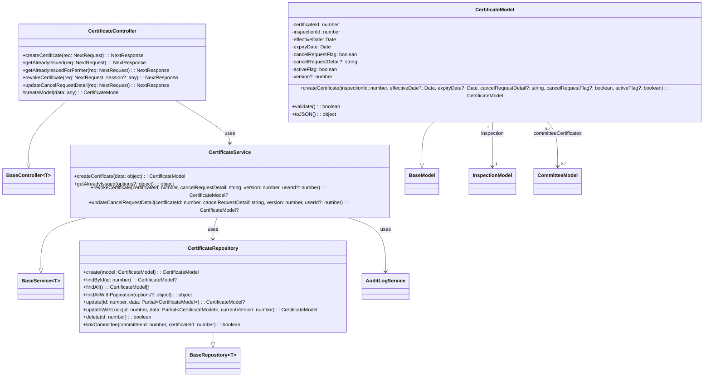

# Certificate

```mermaid
classDiagram

class BaseController~T~
class BaseService~T~
class BaseRepository~T~
class BaseModel
class AuditLogService

class CertificateModel {
  -certificateId: number
  -inspectionId: number
  -effectiveDate: Date
  -expiryDate: Date
  -cancelRequestFlag: boolean
  -cancelRequestDetail?: string
  -activeFlag: boolean
  -version?: number
  +createCertificate(inspectionId: number, effectiveDate?: Date, expiryDate?: Date, cancelRequestDetail?: string, cancelRequestFlag?: boolean, activeFlag?: boolean): CertificateModel
  +validate(): boolean
  +toJSON(): object
}

class CertificateRepository {
  +create(model: CertificateModel): CertificateModel
  +findById(id: number): CertificateModel?
  +findAll(): CertificateModel[]
  +findAllWithPagination(options?: object): object
  +update(id: number, data: Partial~CertificateModel~): CertificateModel?
  +updateWithLock(id: number, data: Partial~CertificateModel~, currentVersion: number): CertificateModel
  +delete(id: number): boolean
  +linkCommittee(committeeId: number, certificateId: number): boolean
}

class CertificateService {
  +createCertificate(data: object): CertificateModel
  +getAlreadyIssued(options?: object): object
  +revokeCertificate(certificateId: number, cancelRequestDetail: string, version: number, userId?: number): CertificateModel?
  +updateCancelRequestDetail(certificateId: number, cancelRequestDetail: string, version: number, userId?: number): CertificateModel?
}

class CertificateController {
  +createCertificate(req: NextRequest): NextResponse
  +getAlreadyIssued(req: NextRequest): NextResponse
  +getAlreadyIssuedForFarmer(req: NextRequest): NextResponse
  +revokeCertificate(req: NextRequest, session?: any): NextResponse
  +updateCancelRequestDetail(req: NextRequest): NextResponse
  #createModel(data: any): CertificateModel
}

CertificateModel --|> BaseModel
CertificateRepository --|> BaseRepository~CertificateModel~
CertificateService --|> BaseService~CertificateModel~
CertificateController --|> BaseController~CertificateModel~

CertificateController --> CertificateService : uses
CertificateService --> CertificateRepository : uses
CertificateService --> AuditLogService : uses

%% simplified relations
class InspectionModel
class CommitteeModel
CertificateModel "1" --> "1" InspectionModel : inspection
CertificateModel "0..*" --> "0..*" CommitteeModel : committeeCertificates
```

