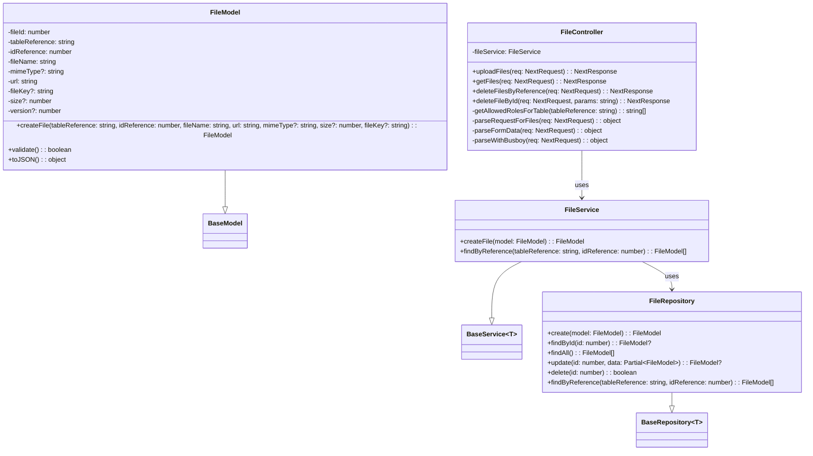

# File Upload

```mermaid
classDiagram

class BaseModel
class BaseService~T~
class BaseRepository~T~

class FileModel {
  -fileId: number
  -tableReference: string
  -idReference: number
  -fileName: string
  -mimeType?: string
  -url: string
  -fileKey?: string
  -size?: number
  -version?: number
  +createFile(tableReference: string, idReference: number, fileName: string, url: string, mimeType?: string, size?: number, fileKey?: string): FileModel
  +validate(): boolean
  +toJSON(): object
}

class FileRepository {
  +create(model: FileModel): FileModel
  +findById(id: number): FileModel?
  +findAll(): FileModel[]
  +update(id: number, data: Partial~FileModel~): FileModel?
  +delete(id: number): boolean
  +findByReference(tableReference: string, idReference: number): FileModel[]
}

class FileService {
  +createFile(model: FileModel): FileModel
  +findByReference(tableReference: string, idReference: number): FileModel[]
}

class FileController {
  -fileService: FileService
  +uploadFiles(req: NextRequest): NextResponse
  +getFiles(req: NextRequest): NextResponse
  +deleteFilesByReference(req: NextRequest): NextResponse
  +deleteFileById(req: NextRequest, params: string): NextResponse
  -getAllowedRolesForTable(tableReference: string): string[]
  -parseRequestForFiles(req: NextRequest): object
  -parseFormData(req: NextRequest): object
  -parseWithBusboy(req: NextRequest): object
}

FileModel --|> BaseModel
FileRepository --|> BaseRepository~FileModel~
FileService --|> BaseService~FileModel~

FileController --> FileService : uses
FileService --> FileRepository : uses
```
