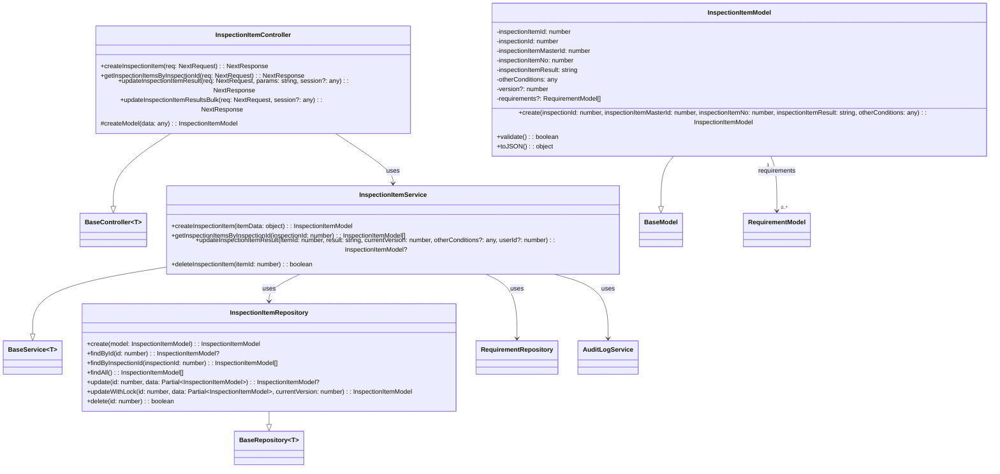

# InspectionItem

```mermaid
classDiagram

class BaseController~T~
class BaseService~T~
class BaseRepository~T~
class BaseModel

class InspectionItemModel {
  -inspectionItemId: number
  -inspectionId: number
  -inspectionItemMasterId: number
  -inspectionItemNo: number
  -inspectionItemResult: string
  -otherConditions: any
  -version?: number
  -requirements?: RequirementModel[]
  +create(inspectionId: number, inspectionItemMasterId: number, inspectionItemNo: number, inspectionItemResult: string, otherConditions: any): InspectionItemModel
  +validate(): boolean
  +toJSON(): object
}

class InspectionItemRepository {
  +create(model: InspectionItemModel): InspectionItemModel
  +findById(id: number): InspectionItemModel?
  +findByInspectionId(inspectionId: number): InspectionItemModel[]
  +findAll(): InspectionItemModel[]
  +update(id: number, data: Partial~InspectionItemModel~): InspectionItemModel?
  +updateWithLock(id: number, data: Partial~InspectionItemModel~, currentVersion: number): InspectionItemModel
  +delete(id: number): boolean
}

class RequirementRepository
class AuditLogService

class InspectionItemService {
  +createInspectionItem(itemData: object): InspectionItemModel
  +getInspectionItemsByInspectionId(inspectionId: number): InspectionItemModel[]
  +updateInspectionItemResult(itemId: number, result: string, currentVersion: number, otherConditions?: any, userId?: number): InspectionItemModel?
  +deleteInspectionItem(itemId: number): boolean
}

class InspectionItemController {
  +createInspectionItem(req: NextRequest): NextResponse
  +getInspectionItemsByInspectionId(req: NextRequest): NextResponse
  +updateInspectionItemResult(req: NextRequest, params: string, session?: any): NextResponse
  +updateInspectionItemResultsBulk(req: NextRequest, session?: any): NextResponse
  #createModel(data: any): InspectionItemModel
}

InspectionItemModel --|> BaseModel
InspectionItemRepository --|> BaseRepository~InspectionItemModel~
InspectionItemService --|> BaseService~InspectionItemModel~
InspectionItemController --|> BaseController~InspectionItemModel~

InspectionItemController --> InspectionItemService : uses
InspectionItemService --> InspectionItemRepository : uses
InspectionItemService --> RequirementRepository : uses
InspectionItemService --> AuditLogService : uses

class RequirementModel
InspectionItemModel "1" --> "0..*" RequirementModel : requirements
```
