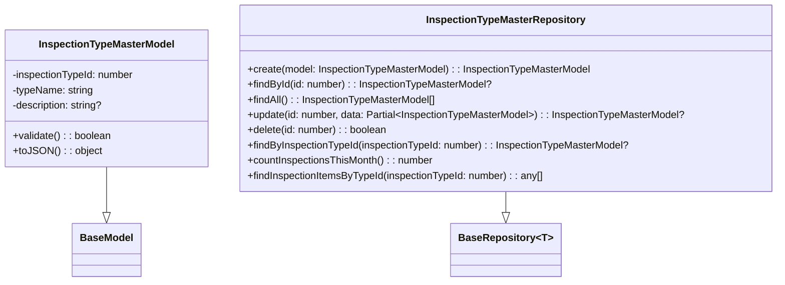

# InspectionTypeMaster

```mermaid
classDiagram

class BaseModel
class BaseRepository~T~

class InspectionTypeMasterModel {
  -inspectionTypeId: number
  -typeName: string
  -description: string?
  +validate(): boolean
  +toJSON(): object
}

class InspectionTypeMasterRepository {
  +create(model: InspectionTypeMasterModel): InspectionTypeMasterModel
  +findById(id: number): InspectionTypeMasterModel?
  +findAll(): InspectionTypeMasterModel[]
  +update(id: number, data: Partial~InspectionTypeMasterModel~): InspectionTypeMasterModel?
  +delete(id: number): boolean
  +findByInspectionTypeId(inspectionTypeId: number): InspectionTypeMasterModel?
  +countInspectionsThisMonth(): number
  +findInspectionItemsByTypeId(inspectionTypeId: number): any[]
}

InspectionTypeMasterModel --|> BaseModel
InspectionTypeMasterRepository --|> BaseRepository~InspectionTypeMasterModel~
```

