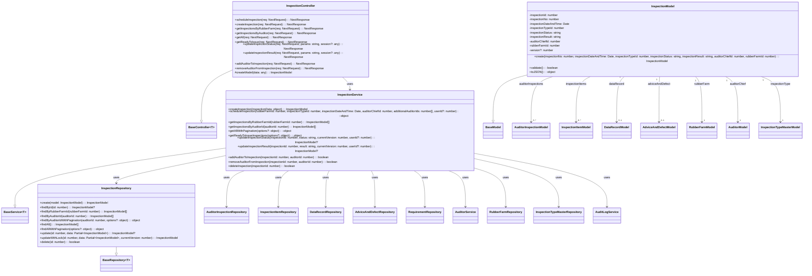

# Inspection

```mermaid
classDiagram

class BaseController~T~
class BaseService~T~
class BaseRepository~T~
class BaseModel

class InspectionModel {
  -inspectionId: number
  -inspectionNo: number
  -inspectionDateAndTime: Date
  -inspectionTypeId: number
  -inspectionStatus: string
  -inspectionResult: string
  -auditorChiefId: number
  -rubberFarmId: number
  -version?: number
  +create(inspectionNo: number, inspectionDateAndTime: Date, inspectionTypeId: number, inspectionStatus: string, inspectionResult: string, auditorChiefId: number, rubberFarmId: number): InspectionModel
  +validate(): boolean
  +toJSON(): object
}

class InspectionRepository {
  +create(model: InspectionModel): InspectionModel
  +findById(id: number): InspectionModel?
  +findByRubberFarmId(rubberFarmId: number): InspectionModel[]
  +findByAuditorId(auditorId: number): InspectionModel[]
  +findByAuditorIdWithPagination(auditorId: number, options?: object): object
  +findAll(): InspectionModel[]
  +findAllWithPagination(options?: object): object
  +update(id: number, data: Partial~InspectionModel~): InspectionModel?
  +updateWithLock(id: number, data: Partial~InspectionModel~, currentVersion: number): InspectionModel
  +delete(id: number): boolean
}

class AuditorInspectionRepository
class InspectionItemRepository
class DataRecordRepository
class AdviceAndDefectRepository
class RequirementRepository
class AuditorService
class RubberFarmRepository
class InspectionTypeMasterRepository
class AuditLogService

class InspectionService {
  +createInspection(inspectionData: object): InspectionModel
  +scheduleInspection(rubberFarmId: number, inspectionTypeId: number, inspectionDateAndTime: Date, auditorChiefId: number, additionalAuditorIds: number[], userId?: number): object
  +getInspectionsByRubberFarmId(rubberFarmId: number): InspectionModel[]
  +getInspectionsByAuditorId(auditorId: number): InspectionModel[]
  +getAllWithPagination(options?: object): object
  +getReadyToIssueInspections(options?: object): object
  +updateInspectionStatus(inspectionId: number, status: string, currentVersion: number, userId?: number): InspectionModel?
  +updateInspectionResult(inspectionId: number, result: string, currentVersion: number, userId?: number): InspectionModel?
  +addAuditorToInspection(inspectionId: number, auditorId: number): boolean
  +removeAuditorFromInspection(inspectionId: number, auditorId: number): boolean
  +deleteInspection(inspectionId: number): boolean
}

class InspectionController {
  +scheduleInspection(req: NextRequest): NextResponse
  +createInspection(req: NextRequest): NextResponse
  +getInspectionsByRubberFarm(req: NextRequest): NextResponse
  +getInspectionsByAuditor(req: NextRequest): NextResponse
  +getAll(req: NextRequest): NextResponse
  +getReadyToIssue(req: NextRequest): NextResponse
  +updateInspectionStatus(req: NextRequest, params: string, session?: any): NextResponse
  +updateInspectionResult(req: NextRequest, params: string, session?: any): NextResponse
  +addAuditorToInspection(req: NextRequest): NextResponse
  +removeAuditorFromInspection(req: NextRequest): NextResponse
  #createModel(data: any): InspectionModel
}

InspectionModel --|> BaseModel
InspectionRepository --|> BaseRepository~InspectionModel~
InspectionService --|> BaseService~InspectionModel~
InspectionController --|> BaseController~InspectionModel~

InspectionController --> InspectionService : uses
InspectionService --> InspectionRepository : uses
InspectionService --> AuditorInspectionRepository : uses
InspectionService --> InspectionItemRepository : uses
InspectionService --> DataRecordRepository : uses
InspectionService --> AdviceAndDefectRepository : uses
InspectionService --> RequirementRepository : uses
InspectionService --> AuditorService : uses
InspectionService --> RubberFarmRepository : uses
InspectionService --> InspectionTypeMasterRepository : uses
InspectionService --> AuditLogService : uses

%% Core model relations (simplified)
class AuditorInspectionModel
class InspectionItemModel
class DataRecordModel
class AdviceAndDefectModel
class RubberFarmModel
class AuditorModel
class InspectionTypeMasterModel

InspectionModel "1" --> "0..*" AuditorInspectionModel : auditorInspections
InspectionModel "1" --> "0..*" InspectionItemModel : inspectionItems
InspectionModel "1" --> "0..1" DataRecordModel : dataRecord
InspectionModel "1" --> "0..1" AdviceAndDefectModel : adviceAndDefect
InspectionModel "1" --> "1" RubberFarmModel : rubberFarm
InspectionModel "1" --> "1" AuditorModel : auditorChief
InspectionModel "1" --> "1" InspectionTypeMasterModel : inspectionType
```
