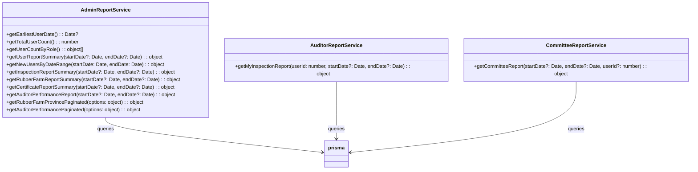

# Report Services

```mermaid
classDiagram

class AdminReportService {
  +getEarliestUserDate(): Date?
  +getTotalUserCount(): number
  +getUserCountByRole(): object[]
  +getUserReportSummary(startDate?: Date, endDate?: Date): object
  +getNewUsersByDateRange(startDate: Date, endDate: Date): object
  +getInspectionReportSummary(startDate?: Date, endDate?: Date): object
  +getRubberFarmReportSummary(startDate?: Date, endDate?: Date): object
  +getCertificateReportSummary(startDate?: Date, endDate?: Date): object
  +getAuditorPerformanceReport(startDate?: Date, endDate?: Date): object
  +getRubberFarmProvincePaginated(options: object): object
  +getAuditorPerformancePaginated(options: object): object
}

class AuditorReportService {
  +getMyInspectionReport(userId: number, startDate?: Date, endDate?: Date): object
}

class CommitteeReportService {
  +getCommitteeReport(startDate?: Date, endDate?: Date, userId?: number): object
}

%% All report services use Prisma directly
class prisma
AdminReportService --> prisma : queries
AuditorReportService --> prisma : queries
CommitteeReportService --> prisma : queries
```

