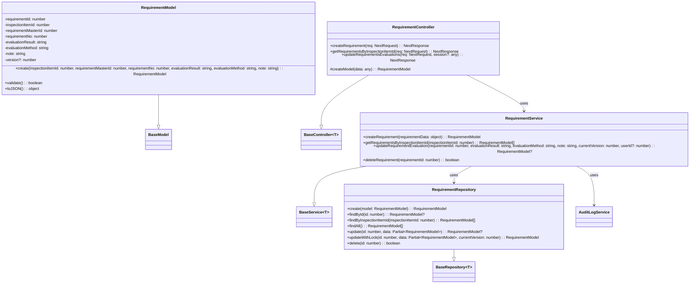

# Requirement

```mermaid
classDiagram

class BaseController~T~
class BaseService~T~
class BaseRepository~T~
class BaseModel
class AuditLogService

class RequirementModel {
  -requirementId: number
  -inspectionItemId: number
  -requirementMasterId: number
  -requirementNo: number
  -evaluationResult: string
  -evaluationMethod: string
  -note: string
  -version?: number
  +create(inspectionItemId: number, requirementMasterId: number, requirementNo: number, evaluationResult: string, evaluationMethod: string, note: string): RequirementModel
  +validate(): boolean
  +toJSON(): object
}

class RequirementRepository {
  +create(model: RequirementModel): RequirementModel
  +findById(id: number): RequirementModel?
  +findByInspectionItemId(inspectionItemId: number): RequirementModel[]
  +findAll(): RequirementModel[]
  +update(id: number, data: Partial~RequirementModel~): RequirementModel?
  +updateWithLock(id: number, data: Partial~RequirementModel~, currentVersion: number): RequirementModel
  +delete(id: number): boolean
}

class RequirementService {
  +createRequirement(requirementData: object): RequirementModel
  +getRequirementsByInspectionItemId(inspectionItemId: number): RequirementModel[]
  +updateRequirementEvaluation(requirementId: number, evaluationResult: string, evaluationMethod: string, note: string, currentVersion: number, userId?: number): RequirementModel?
  +deleteRequirement(requirementId: number): boolean
}

class RequirementController {
  +createRequirement(req: NextRequest): NextResponse
  +getRequirementsByInspectionItemId(req: NextRequest): NextResponse
  +updateRequirementsEvaluations(req: NextRequest, session?: any): NextResponse
  #createModel(data: any): RequirementModel
}

RequirementModel --|> BaseModel
RequirementRepository --|> BaseRepository~RequirementModel~
RequirementService --|> BaseService~RequirementModel~
RequirementController --|> BaseController~RequirementModel~

RequirementController --> RequirementService : uses
RequirementService --> RequirementRepository : uses
RequirementService --> AuditLogService : uses
```

