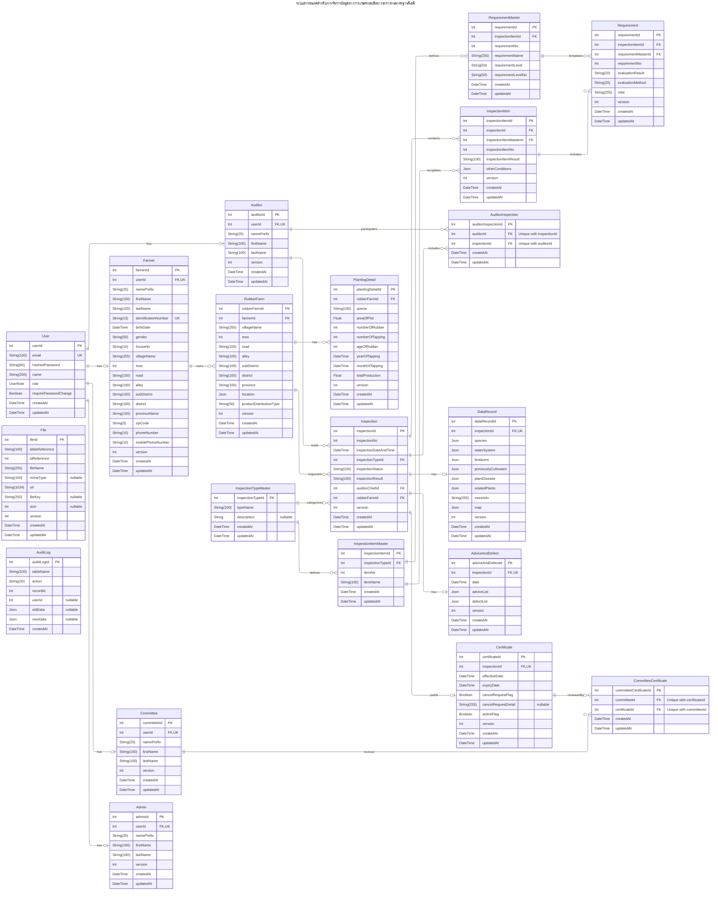

```mermaid
---
title: ระบบสารสนเทศสำหรับการจัดการข้อมูลทางการเกษตรผลผลิตยางพาราตามมาตรฐานจีเอพี
config:
  layout: elk
---
erDiagram
	direction LR

	User ||--o| Farmer : has
	User ||--o| Auditor : has
	User ||--o| Committee : has
	User ||--o| Admin : has

	Farmer ||--o{ RubberFarm : owns
	RubberFarm ||--o{ PlantingDetail : has
	RubberFarm ||--o{ Inspection : inspected

	InspectionTypeMaster ||--o{ Inspection : categorizes
	InspectionTypeMaster ||--o{ InspectionItemMaster : defines
	InspectionItemMaster ||--o{ RequirementMaster : defines

	Inspection ||--o{ InspectionItem : contains
	InspectionItemMaster ||--o{ InspectionItem : templates
	InspectionItem ||--o{ Requirement : includes
	RequirementMaster ||--o{ Requirement : templates

	Auditor ||--o{ Inspection : leads
	Auditor ||--o{ AuditorInspection : participates
	Inspection ||--o{ AuditorInspection : includes

	Inspection ||--o| DataRecord : has
	Inspection ||--o| AdviceAndDefect : has
	Inspection ||--o| Certificate : yields

	Committee ||--o{ CommitteeCertificate : reviews
	Certificate ||--o{ CommitteeCertificate : reviewedBy

	User {
		Int userId PK
		String(100) email UK
		String(60) hashedPassword
		String(200) name
		UserRole role
		Boolean requirePasswordChange
		DateTime createdAt
		DateTime updatedAt
	}

	Farmer {
		Int farmerId PK
		Int userId FK, UK
		String(25) namePrefix
		String(100) firstName
		String(100) lastName
		String(13) identificationNumber UK
		DateTime birthDate
		String(50) gender
		String(10) houseNo
		String(255) villageName
		Int moo
		String(100) road
		String(100) alley
		String(100) subDistrict
		String(100) district
		String(100) provinceName
		String(5) zipCode
		String(10) phoneNumber
		String(10) mobilePhoneNumber
		Int version
		DateTime createdAt
		DateTime updatedAt
	}

	Auditor {
		Int auditorId PK
		Int userId FK, UK
		String(25) namePrefix
		String(100) firstName
		String(100) lastName
		Int version
		DateTime createdAt
		DateTime updatedAt
	}

	Committee {
		Int committeeId PK
		Int userId FK, UK
		String(25) namePrefix
		String(100) firstName
		String(100) lastName
		Int version
		DateTime createdAt
		DateTime updatedAt
	}

	Admin {
		Int adminId PK
		Int userId FK, UK
		String(25) namePrefix
		String(100) firstName
		String(100) lastName
		Int version
		DateTime createdAt
		DateTime updatedAt
	}

	RubberFarm {
		Int rubberFarmId PK
		Int farmerId FK
		String(255) villageName
		Int moo
		String(100) road
		String(100) alley
		String(100) subDistrict
		String(100) district
		String(100) province
		Json location
		String(50) productDistributionType
		Int version
		DateTime createdAt
		DateTime updatedAt
	}

	PlantingDetail {
		Int plantingDetailId PK
		Int rubberFarmId FK
		String(100) specie
		Float areaOfPlot
		Int numberOfRubber
		Int numberOfTapping
		Int ageOfRubber
		DateTime yearOfTapping
		DateTime monthOfTapping
		Float totalProduction
		Int version
		DateTime createdAt
		DateTime updatedAt
	}

	InspectionTypeMaster {
		Int inspectionTypeId PK
		String(100) typeName
		String description "nullable"
		DateTime createdAt
		DateTime updatedAt
	}

	InspectionItemMaster {
		Int inspectionItemId PK
		Int inspectionTypeId FK
		Int itemNo
		String(100) itemName
		DateTime createdAt
		DateTime updatedAt
	}

	RequirementMaster {
		Int requirementId PK
		Int inspectionItemId FK
		Int requirementNo
		String(255) requirementName
		String(50) requirementLevel
		String(50) requirementLevelNo
		DateTime createdAt
		DateTime updatedAt
	}

	Inspection {
		Int inspectionId PK
		Int inspectionNo
		DateTime inspectionDateAndTime
		Int inspectionTypeId FK
		String(100) inspectionStatus
		String(100) inspectionResult
		Int auditorChiefId FK
		Int rubberFarmId FK
		Int version
		DateTime createdAt
		DateTime updatedAt
	}

	AuditorInspection {
		Int auditorInspectionId PK
		Int auditorId FK "Unique with inspectionId"
		Int inspectionId FK "Unique with auditorId"
		DateTime createdAt
		DateTime updatedAt
	}

	InspectionItem {
		Int inspectionItemId PK
		Int inspectionId FK
		Int inspectionItemMasterId FK
		Int inspectionItemNo
		String(100) inspectionItemResult
		Json otherConditions
		Int version
		DateTime createdAt
		DateTime updatedAt
	}

	Requirement {
		Int requirementId PK
		Int inspectionItemId FK
		Int requirementMasterId FK
		Int requirementNo
		String(20) evaluationResult
		String(20) evaluationMethod
		String(255) note
		Int version
		DateTime createdAt
		DateTime updatedAt
	}

	DataRecord {
		Int dataRecordId PK
		Int inspectionId FK, UK
		Json species
		Json waterSystem
		Json fertilizers
		Json previouslyCultivated
		Json plantDisease
		Json relatedPlants
		String(255) moreInfo
		Json map
		Int version
		DateTime createdAt
		DateTime updatedAt
	}

	AdviceAndDefect {
		Int adviceAndDefectId PK
		Int inspectionId FK, UK
		DateTime date
		Json adviceList
		Json defectList
		Int version
		DateTime createdAt
		DateTime updatedAt
	}

	Certificate {
		Int certificateId PK
		Int inspectionId FK, UK
		DateTime effectiveDate
		DateTime expiryDate
		Boolean cancelRequestFlag
		String(255) cancelRequestDetail "nullable"
		Boolean activeFlag
		Int version
		DateTime createdAt
		DateTime updatedAt
	}

	CommitteeCertificate {
		Int committeeCertificateId PK
		Int committeeId FK "Unique with certificateId"
		Int certificateId FK "Unique with committeeId"
		DateTime createdAt
		DateTime updatedAt
	}

	File {
		Int fileId PK
		String(100) tableReference
		Int idReference
		String(255) fileName
		String(100) mimeType "nullable"
		String(1024) url
		String(255) fileKey "nullable"
		Int size "nullable"
		Int version
		DateTime createdAt
		DateTime updatedAt
	}

	AuditLog {
		Int auditLogId PK
		String(100) tableName
		String(20) action
		Int recordId
		Int userId "nullable"
		Json oldData "nullable"
		Json newData "nullable"
		DateTime createdAt
	}
```
