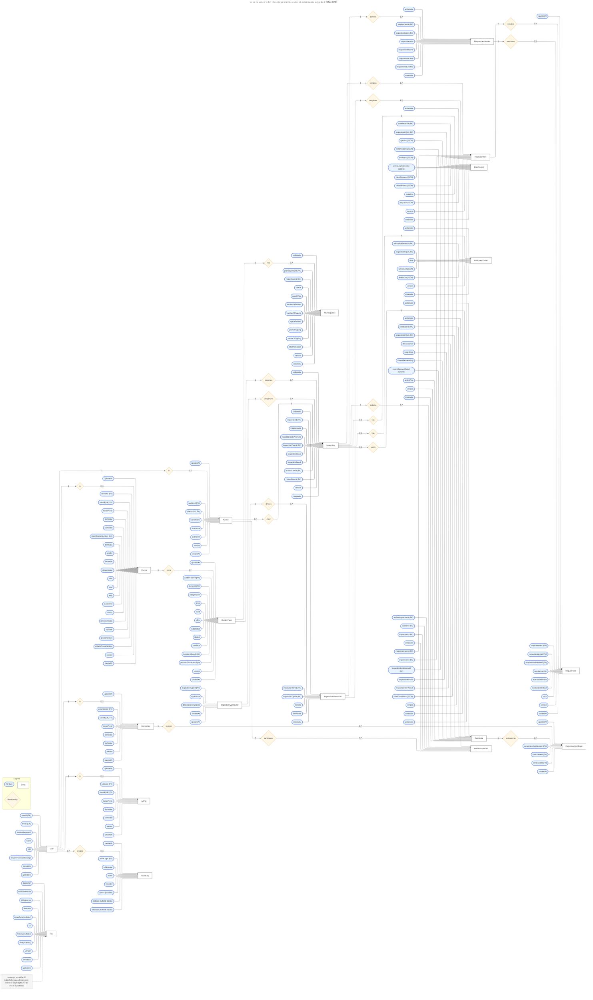

```mermaid
---
title: ระบบสารสนเทศสำหรับการจัดการข้อมูลทางการเกษตรผลผลิตยางพาราตามมาตรฐานจีเอพี (Chen ERD)
config:
  layout: elk
---
flowchart LR
  %% Chen-style ERD (Entity=rectangle, Relationship=diamond, Attribute=oval-like)
  %% หมายเหตุ: Mermaid ไม่มี Chen ERD โดยตรง จึงจำลองด้วย flowchart shapes

  %% ---------- Legend ----------
  subgraph LEGEND["Legend"]
    direction TB
    L_ENTITY[Entity]:::entity
    L_REL{Relationship}:::rel
    L_ATTR([Attribute]):::attr
  end

  %% ---------- Entities ----------
  U[User]:::entity
  Fm[Farmer]:::entity
  Au[Auditor]:::entity
  Cm[Committee]:::entity
  Ad[Admin]:::entity
  RF[RubberFarm]:::entity
  PD[PlantingDetail]:::entity
  Ins[Inspection]:::entity
  ITM[InspectionTypeMaster]:::entity
  IIM[InspectionItemMaster]:::entity
  RM[RequirementMaster]:::entity
  II[InspectionItem]:::entity
  Rq[Requirement]:::entity
  DR[DataRecord]:::entity
  ADF[AdviceAndDefect]:::entity
  Cert[Certificate]:::entity
  AI[AuditorInspection]:::entity
  CC[CommitteeCertificate]:::entity
  FileE[File]:::entity
  LogE[AuditLog]:::entity

  %% ---------- Relationships (diamonds) ----------
  R_U_Fm{is}:::rel
  U -- "1" --> R_U_Fm
  R_U_Fm -- "0..1" --> Fm

  R_U_Au{is}:::rel
  U -- "1" --> R_U_Au
  R_U_Au -- "0..1" --> Au

  R_U_Cm{is}:::rel
  U -- "1" --> R_U_Cm
  R_U_Cm -- "0..1" --> Cm

  R_U_Ad{is}:::rel
  U -- "1" --> R_U_Ad
  R_U_Ad -- "0..1" --> Ad

  R_Fm_RF{owns}:::rel
  Fm -- "1" --> R_Fm_RF
  R_Fm_RF -- "0..*" --> RF

  R_RF_PD{has}:::rel
  RF -- "1" --> R_RF_PD
  R_RF_PD -- "0..*" --> PD

  R_RF_Ins{inspected}:::rel
  RF -- "1" --> R_RF_Ins
  R_RF_Ins -- "0..*" --> Ins

  R_ITM_Ins{categorizes}:::rel
  ITM -- "1" --> R_ITM_Ins
  R_ITM_Ins -- "0..*" --> Ins

  R_ITM_IIM{defines}:::rel
  ITM -- "1" --> R_ITM_IIM
  R_ITM_IIM -- "0..*" --> IIM

  R_IIM_RM{defines}:::rel
  IIM -- "1" --> R_IIM_RM
  R_IIM_RM -- "0..*" --> RM

  R_Ins_II{contains}:::rel
  Ins -- "1" --> R_Ins_II
  R_Ins_II -- "0..*" --> II

  R_IIM_II{templates}:::rel
  IIM -- "1" --> R_IIM_II
  R_IIM_II -- "0..*" --> II

  R_II_Rq{includes}:::rel
  II -- "1" --> R_II_Rq
  R_II_Rq -- "0..*" --> Rq

  R_RM_Rq{templates}:::rel
  RM -- "1" --> R_RM_Rq
  R_RM_Rq -- "0..*" --> Rq

  R_Au_Ins{chief}:::rel
  Au -- "0..*" --> R_Au_Ins
  R_Au_Ins -- "1" --> Ins

  %% Associative entity: AuditorInspection (resolves many-to-many)
  R_Au_AI{participates}:::rel
  Au -- "1" --> R_Au_AI
  R_Au_AI -- "0..*" --> AI

  R_Ins_AI{includes}:::rel
  Ins -- "1" --> R_Ins_AI
  R_Ins_AI -- "0..*" --> AI

  %% Optional 1-1 detail tables
  R_Ins_DR{has}:::rel
  Ins -- "0..1" --> R_Ins_DR
  R_Ins_DR -- "1" --> DR

  R_Ins_ADF{has}:::rel
  Ins -- "0..1" --> R_Ins_ADF
  R_Ins_ADF -- "1" --> ADF

  R_Ins_Cert{yields}:::rel
  Ins -- "0..1" --> R_Ins_Cert
  R_Ins_Cert -- "1" --> Cert

  %% Associative entity: CommitteeCertificate (resolves many-to-many)
  R_Cm_CC{reviews}:::rel
  Cm -- "1" --> R_Cm_CC
  R_Cm_CC -- "0..*" --> CC

  R_Cert_CC{reviewed-by}:::rel
  Cert -- "1" --> R_Cert_CC
  R_Cert_CC -- "0..*" --> CC

  %% AuditLog optionally references User
  R_U_Log{creates}:::rel
  U -- "0..*" --> R_U_Log
  R_U_Log -- "0..1" --> LogE

  %% ---------- Attributes (ครบทุกคอลัมน์ตาม schema.prisma) ----------
  %% User
  U_userId(["userId (PK)"]):::attr --- U
  U_email(["email (UK)"]):::attr --- U
  U_hashedPassword(["hashedPassword"]):::attr --- U
  U_name(["name"]):::attr --- U
  U_role(["role"]):::attr --- U
  U_requirePasswordChange(["requirePasswordChange"]):::attr --- U
  U_createdAt(["createdAt"]):::attr --- U
  U_updatedAt(["updatedAt"]):::attr --- U

  %% Farmer
  Fm_farmerId(["farmerId (PK)"]):::attr --- Fm
  Fm_userId(["userId (UK, FK)"]):::attr --- Fm
  Fm_namePrefix(["namePrefix"]):::attr --- Fm
  Fm_firstName(["firstName"]):::attr --- Fm
  Fm_lastName(["lastName"]):::attr --- Fm
  Fm_identificationNumber(["identificationNumber (UK)"]):::attr --- Fm
  Fm_birthDate(["birthDate"]):::attr --- Fm
  Fm_gender(["gender"]):::attr --- Fm
  Fm_houseNo(["houseNo"]):::attr --- Fm
  Fm_villageName(["villageName"]):::attr --- Fm
  Fm_moo(["moo"]):::attr --- Fm
  Fm_road(["road"]):::attr --- Fm
  Fm_alley(["alley"]):::attr --- Fm
  Fm_subDistrict(["subDistrict"]):::attr --- Fm
  Fm_district(["district"]):::attr --- Fm
  Fm_provinceName(["provinceName"]):::attr --- Fm
  Fm_zipCode(["zipCode"]):::attr --- Fm
  Fm_phoneNumber(["phoneNumber"]):::attr --- Fm
  Fm_mobilePhoneNumber(["mobilePhoneNumber"]):::attr --- Fm
  Fm_version(["version"]):::attr --- Fm
  Fm_createdAt(["createdAt"]):::attr --- Fm
  Fm_updatedAt(["updatedAt"]):::attr --- Fm

  %% Auditor
  Au_auditorId(["auditorId (PK)"]):::attr --- Au
  Au_userId(["userId (UK, FK)"]):::attr --- Au
  Au_namePrefix(["namePrefix"]):::attr --- Au
  Au_firstName(["firstName"]):::attr --- Au
  Au_lastName(["lastName"]):::attr --- Au
  Au_version(["version"]):::attr --- Au
  Au_createdAt(["createdAt"]):::attr --- Au
  Au_updatedAt(["updatedAt"]):::attr --- Au

  %% Committee
  Cm_committeeId(["committeeId (PK)"]):::attr --- Cm
  Cm_userId(["userId (UK, FK)"]):::attr --- Cm
  Cm_namePrefix(["namePrefix"]):::attr --- Cm
  Cm_firstName(["firstName"]):::attr --- Cm
  Cm_lastName(["lastName"]):::attr --- Cm
  Cm_version(["version"]):::attr --- Cm
  Cm_createdAt(["createdAt"]):::attr --- Cm
  Cm_updatedAt(["updatedAt"]):::attr --- Cm

  %% Admin
  Ad_adminId(["adminId (PK)"]):::attr --- Ad
  Ad_userId(["userId (UK, FK)"]):::attr --- Ad
  Ad_namePrefix(["namePrefix"]):::attr --- Ad
  Ad_firstName(["firstName"]):::attr --- Ad
  Ad_lastName(["lastName"]):::attr --- Ad
  Ad_version(["version"]):::attr --- Ad
  Ad_createdAt(["createdAt"]):::attr --- Ad
  Ad_updatedAt(["updatedAt"]):::attr --- Ad

  %% RubberFarm
  RF_rubberFarmId(["rubberFarmId (PK)"]):::attr --- RF
  RF_farmerId(["farmerId (FK)"]):::attr --- RF
  RF_villageName(["villageName"]):::attr --- RF
  RF_moo(["moo"]):::attr --- RF
  RF_road(["road"]):::attr --- RF
  RF_alley(["alley"]):::attr --- RF
  RF_subDistrict(["subDistrict"]):::attr --- RF
  RF_district(["district"]):::attr --- RF
  RF_province(["province"]):::attr --- RF
  RF_location(["location (GeoJSON)"]):::attr --- RF
  RF_productDistributionType(["productDistributionType"]):::attr --- RF
  RF_version(["version"]):::attr --- RF
  RF_createdAt(["createdAt"]):::attr --- RF
  RF_updatedAt(["updatedAt"]):::attr --- RF

  %% PlantingDetail
  PD_plantingDetailId(["plantingDetailId (PK)"]):::attr --- PD
  PD_rubberFarmId(["rubberFarmId (FK)"]):::attr --- PD
  PD_specie(["specie"]):::attr --- PD
  PD_areaOfPlot(["areaOfPlot"]):::attr --- PD
  PD_numberOfRubber(["numberOfRubber"]):::attr --- PD
  PD_numberOfTapping(["numberOfTapping"]):::attr --- PD
  PD_ageOfRubber(["ageOfRubber"]):::attr --- PD
  PD_yearOfTapping(["yearOfTapping"]):::attr --- PD
  PD_monthOfTapping(["monthOfTapping"]):::attr --- PD
  PD_totalProduction(["totalProduction"]):::attr --- PD
  PD_version(["version"]):::attr --- PD
  PD_createdAt(["createdAt"]):::attr --- PD
  PD_updatedAt(["updatedAt"]):::attr --- PD

  %% InspectionTypeMaster
  ITM_inspectionTypeId(["inspectionTypeId (PK)"]):::attr --- ITM
  ITM_typeName(["typeName"]):::attr --- ITM
  ITM_description(["description (nullable)"]):::attr --- ITM
  ITM_createdAt(["createdAt"]):::attr --- ITM
  ITM_updatedAt(["updatedAt"]):::attr --- ITM

  %% InspectionItemMaster
  IIM_inspectionItemId(["inspectionItemId (PK)"]):::attr --- IIM
  IIM_inspectionTypeId(["inspectionTypeId (FK)"]):::attr --- IIM
  IIM_itemNo(["itemNo"]):::attr --- IIM
  IIM_itemName(["itemName"]):::attr --- IIM
  IIM_createdAt(["createdAt"]):::attr --- IIM
  IIM_updatedAt(["updatedAt"]):::attr --- IIM

  %% RequirementMaster
  RM_requirementId(["requirementId (PK)"]):::attr --- RM
  RM_inspectionItemId(["inspectionItemId (FK)"]):::attr --- RM
  RM_requirementNo(["requirementNo"]):::attr --- RM
  RM_requirementName(["requirementName"]):::attr --- RM
  RM_requirementLevel(["requirementLevel"]):::attr --- RM
  RM_requirementLevelNo(["requirementLevelNo"]):::attr --- RM
  RM_createdAt(["createdAt"]):::attr --- RM
  RM_updatedAt(["updatedAt"]):::attr --- RM

  %% Inspection
  Ins_inspectionId(["inspectionId (PK)"]):::attr --- Ins
  Ins_inspectionNo(["inspectionNo"]):::attr --- Ins
  Ins_inspectionDateAndTime(["inspectionDateAndTime"]):::attr --- Ins
  Ins_inspectionTypeId(["inspectionTypeId (FK)"]):::attr --- Ins
  Ins_inspectionStatus(["inspectionStatus"]):::attr --- Ins
  Ins_inspectionResult(["inspectionResult"]):::attr --- Ins
  Ins_auditorChiefId(["auditorChiefId (FK)"]):::attr --- Ins
  Ins_rubberFarmId(["rubberFarmId (FK)"]):::attr --- Ins
  Ins_version(["version"]):::attr --- Ins
  Ins_createdAt(["createdAt"]):::attr --- Ins
  Ins_updatedAt(["updatedAt"]):::attr --- Ins

  %% AuditorInspection (join)
  AI_auditorInspectionId(["auditorInspectionId (PK)"]):::attr --- AI
  AI_auditorId(["auditorId (FK)"]):::attr --- AI
  AI_inspectionId(["inspectionId (FK)"]):::attr --- AI
  AI_createdAt(["createdAt"]):::attr --- AI
  AI_updatedAt(["updatedAt"]):::attr --- AI

  %% InspectionItem
  II_inspectionItemId(["inspectionItemId (PK)"]):::attr --- II
  II_inspectionId(["inspectionId (FK)"]):::attr --- II
  II_inspectionItemMasterId(["inspectionItemMasterId (FK)"]):::attr --- II
  II_inspectionItemNo(["inspectionItemNo"]):::attr --- II
  II_inspectionItemResult(["inspectionItemResult"]):::attr --- II
  II_otherConditions(["otherConditions (JSON)"]):::attr --- II
  II_version(["version"]):::attr --- II
  II_createdAt(["createdAt"]):::attr --- II
  II_updatedAt(["updatedAt"]):::attr --- II

  %% Requirement
  Rq_requirementId(["requirementId (PK)"]):::attr --- Rq
  Rq_inspectionItemId(["inspectionItemId (FK)"]):::attr --- Rq
  Rq_requirementMasterId(["requirementMasterId (FK)"]):::attr --- Rq
  Rq_requirementNo(["requirementNo"]):::attr --- Rq
  Rq_evaluationResult(["evaluationResult"]):::attr --- Rq
  Rq_evaluationMethod(["evaluationMethod"]):::attr --- Rq
  Rq_note(["note"]):::attr --- Rq
  Rq_version(["version"]):::attr --- Rq
  Rq_createdAt(["createdAt"]):::attr --- Rq
  Rq_updatedAt(["updatedAt"]):::attr --- Rq

  %% DataRecord
  DR_dataRecordId(["dataRecordId (PK)"]):::attr --- DR
  DR_inspectionId(["inspectionId (UK, FK)"]):::attr --- DR
  DR_species(["species (JSON)"]):::attr --- DR
  DR_waterSystem(["waterSystem (JSON)"]):::attr --- DR
  DR_fertilizers(["fertilizers (JSON)"]):::attr --- DR
  DR_previouslyCultivated(["previouslyCultivated (JSON)"]):::attr --- DR
  DR_plantDisease(["plantDisease (JSON)"]):::attr --- DR
  DR_relatedPlants(["relatedPlants (JSON)"]):::attr --- DR
  DR_moreInfo(["moreInfo"]):::attr --- DR
  DR_map(["map (GeoJSON)"]):::attr --- DR
  DR_version(["version"]):::attr --- DR
  DR_createdAt(["createdAt"]):::attr --- DR
  DR_updatedAt(["updatedAt"]):::attr --- DR

  %% AdviceAndDefect
  ADF_adviceAndDefectId(["adviceAndDefectId (PK)"]):::attr --- ADF
  ADF_inspectionId(["inspectionId (UK, FK)"]):::attr --- ADF
  ADF_date(["date"]):::attr --- ADF
  ADF_adviceList(["adviceList (JSON)"]):::attr --- ADF
  ADF_defectList(["defectList (JSON)"]):::attr --- ADF
  ADF_version(["version"]):::attr --- ADF
  ADF_createdAt(["createdAt"]):::attr --- ADF
  ADF_updatedAt(["updatedAt"]):::attr --- ADF

  %% Certificate
  Cert_certificateId(["certificateId (PK)"]):::attr --- Cert
  Cert_inspectionId(["inspectionId (UK, FK)"]):::attr --- Cert
  Cert_effectiveDate(["effectiveDate"]):::attr --- Cert
  Cert_expiryDate(["expiryDate"]):::attr --- Cert
  Cert_cancelRequestFlag(["cancelRequestFlag"]):::attr --- Cert
  Cert_cancelRequestDetail(["cancelRequestDetail (nullable)"]):::attr --- Cert
  Cert_activeFlag(["activeFlag"]):::attr --- Cert
  Cert_version(["version"]):::attr --- Cert
  Cert_createdAt(["createdAt"]):::attr --- Cert
  Cert_updatedAt(["updatedAt"]):::attr --- Cert

  %% CommitteeCertificate (join)
  CC_committeeCertificateId(["committeeCertificateId (PK)"]):::attr --- CC
  CC_committeeId(["committeeId (FK)"]):::attr --- CC
  CC_certificateId(["certificateId (FK)"]):::attr --- CC
  CC_createdAt(["createdAt"]):::attr --- CC
  CC_updatedAt(["updatedAt"]):::attr --- CC

  %% File
  File_fileId(["fileId (PK)"]):::attr --- FileE
  File_tableReference(["tableReference"]):::attr --- FileE
  File_idReference(["idReference"]):::attr --- FileE
  File_fileName(["fileName"]):::attr --- FileE
  File_mimeType(["mimeType (nullable)"]):::attr --- FileE
  File_url(["url"]):::attr --- FileE
  File_fileKey(["fileKey (nullable)"]):::attr --- FileE
  File_size(["size (nullable)"]):::attr --- FileE
  File_version(["version"]):::attr --- FileE
  File_createdAt(["createdAt"]):::attr --- FileE
  File_updatedAt(["updatedAt"]):::attr --- FileE

  %% AuditLog
  Log_auditLogId(["auditLogId (PK)"]):::attr --- LogE
  Log_tableName(["tableName"]):::attr --- LogE
  Log_action(["action"]):::attr --- LogE
  Log_recordId(["recordId"]):::attr --- LogE
  Log_userId(["userId (nullable)"]):::attr --- LogE
  Log_oldData(["oldData (nullable JSON)"]):::attr --- LogE
  Log_newData(["newData (nullable JSON)"]):::attr --- LogE
  Log_createdAt(["createdAt"]):::attr --- LogE

  NOTE["*หมายเหตุ*: ตาราง File ใช้ (tableReference,idReference) อ้างอิงแบบ polymorphic จึงไม่มี FK ตรงใน schema"]:::note
  NOTE -.-> FileE

  %% ---------- Styles ----------
  classDef entity fill:#ffffff,stroke:#111827,stroke-width:1px;
  classDef rel fill:#fff7e6,stroke:#c77d00,stroke-width:1px;
  classDef attr fill:#e8f3ff,stroke:#1d4ed8,stroke-width:1px;
  classDef note fill:#f5f5f5,stroke:#6b7280,stroke-dasharray: 3 3;
```
