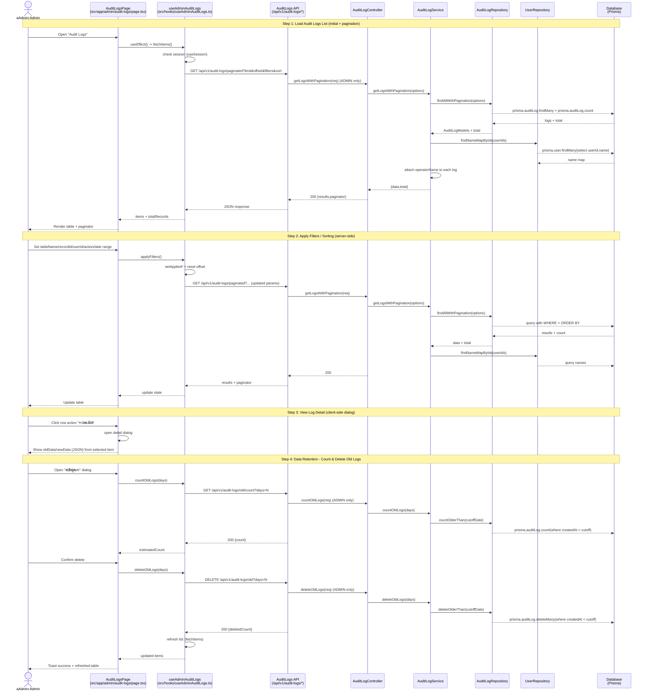

# Admin Audit Logs - Sequence Diagram (High-Level)

## High-Level Overview

### Main Flow

1. **Load Audit Logs** - โหลดรายการ audit logs แบบ server-side pagination
2. **Filter/Sort** - กรองตาม tableName/recordId/userId/action/ช่วงวันที่ และเรียงลำดับผ่าน API
3. **View Detail** - เปิด dialog เพื่อดู `oldData`/`newData` ของรายการที่เลือก
4. **Retention Cleanup** - นับจำนวน log เก่าเกินกำหนด และสั่งลบแบบ bulk

### Key Components

- `src/app/admin/audit-logs/page.tsx` - UI หน้า audit logs + dialogs
- `src/hooks/useAdminAuditLogs.ts` - state, pagination/sort/filter, เรียก API
- `src/app/api/v1/audit-logs/paginated/route.ts` - `GET` แบบ pagination + filter
- `src/app/api/v1/audit-logs/old/count/route.ts` - `GET` นับจำนวน log เก่า
- `src/app/api/v1/audit-logs/old/route.ts` - `DELETE` ลบ log เก่าเกินกำหนด
- `src/controllers/AuditLogController.ts` → `src/services/AuditLogService.ts` → `src/repositories/AuditLogRepository.ts`
- `src/repositories/UserRepository.ts` - map `userId -> name` เพื่อเติม `operatorName`

### Endpoints Used By This Page

- `GET /api/v1/audit-logs/paginated?limit&offset&tableName&recordId&userId&action&startDate&endDate&sortField&sortOrder&multiSortMeta`
- `GET /api/v1/audit-logs/old/count?days=N`
- `DELETE /api/v1/audit-logs/old?days=N`
