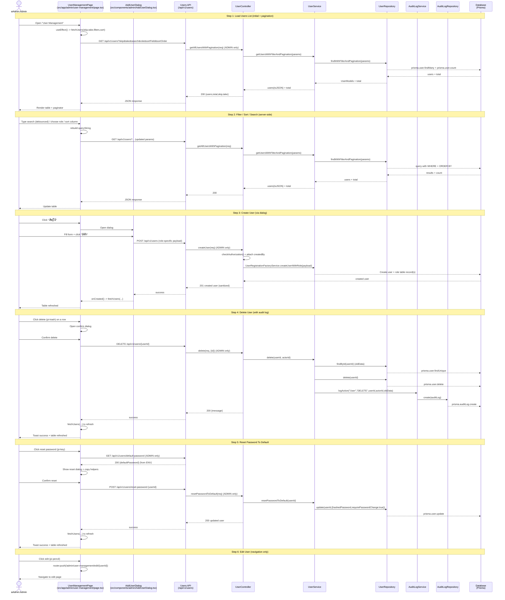

# Admin User Management - Sequence Diagram (High-Level)

## High-Level Overview

### Main Flow

1. **Load Users List** - โหลดรายการผู้ใช้แบบ server-side pagination
2. **Filter/Sort/Search** - ค้นหา/กรองบทบาท/เรียงลำดับ และโหลดข้อมูลใหม่จาก API
3. **Create User** - เพิ่มผู้ใช้ผ่าน `AddUserDialog` แล้ว refresh ตาราง
4. **Delete User** - ลบผู้ใช้ (พร้อมบันทึก `AuditLog` ประเภท `DELETE`)
5. **Reset Password** - รีเซ็ตรหัสผ่านเป็นค่าเริ่มต้น (DEFAULT_PASSWORD) และบังคับเปลี่ยนรหัสผ่านครั้งถัดไป
6. **Edit User** - ไปหน้าแก้ไขผู้ใช้ (routing)

### Key Components

- `src/app/admin/user-management/page.tsx` - หน้า list + filter + actions (add/edit/delete/reset)
- `src/components/admin/AddUserDialog.tsx` - ฟอร์มเพิ่มผู้ใช้และยิง `POST /api/v1/users`
- `src/app/api/v1/users/*` - Route handlers ตรวจสิทธิ์ `ADMIN` แล้วเรียก controller/service
- `src/controllers/UserController.ts` → `src/services/UserService.ts` → `src/repositories/UserRepository.ts`
- `src/services/AuditLogService.ts` → `src/repositories/AuditLogRepository.ts` (ตอนลบผู้ใช้)

### Endpoints Used By This Page

- `GET /api/v1/users?skip&take&search&role&sortField&sortOrder` - ดึงรายการผู้ใช้แบบ pagination
- `POST /api/v1/users` - สร้างผู้ใช้ใหม่
- `DELETE /api/v1/users/{id}` - ลบผู้ใช้
- `GET /api/v1/users/default-password` - ดึง DEFAULT_PASSWORD (admin-only)
- `POST /api/v1/users/reset-password` - รีเซ็ตรหัสผ่านเป็นค่าเริ่มต้น
