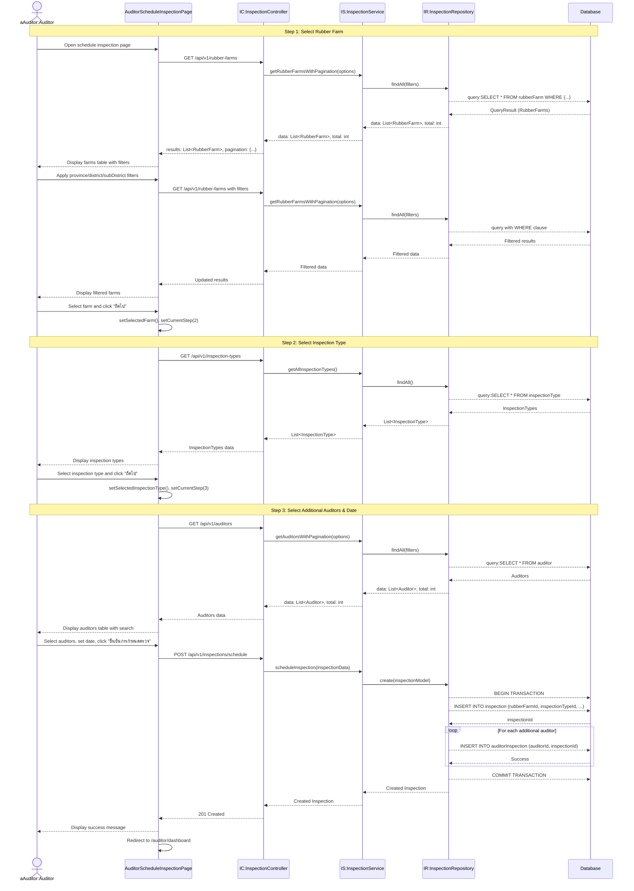

# Auditor Applications - Sequence Diagram (High-Level)

## High-Level Overview

### Main Flow

1. **Select Rubber Farm** - ผู้ตรวจประเมินเลือกสวนยางที่ต้องการนัดตรวจ พร้อมกรองตามพื้นที่
2. **Select Inspection Type** - เลือกประเภทการตรวจประเมิน (ตรวจประเมินเบื้องต้น, ตรวจประเมินหลัก, ฯลฯ)
3. **Select Additional Auditors & Date** - เลือกผู้ตรวจเพิ่มเติม กำหนดวันที่-เวลา และยืนยันการนัดตรวจ

### Key Components

- **AuditorScheduleInspectionPage** - UI component สำหรับกำหนดการตรวจประเมิน (3-step wizard)
- **InspectionController** - จัดการ request/response สำหรับการสร้างการตรวจ
- **InspectionService** - Business logic สำหรับจัดการการตรวจประเมิน
- **InspectionRepository** - Data access layer สำหรับบันทึกข้อมูลการตรวจ
- **RubberFarmController** - จัดการข้อมูลสวนยางสำหรับเลือกนัด
- **AuditorController** - จัดการข้อมูลผู้ตรวจเพิ่มเติม

### Features

- Multi-step wizard (3 steps) พร้อม progress indicator
- Pagination และ Multi-sort สำหรับรายการสวนยาง
- Filter สวนยางตามจังหวัด/อำเภอ/ตำบล (3-level cascading)
- แสดงรายละเอียดสวนยางในโมดอล (location map, planting details)
- เลือกประเภทการตรวจจาก master data
- Search และ pagination สำหรับเลือกผู้ตรวจเพิ่มเติม
- Calendar picker สำหรับกำหนดวันที่-เวลาตรวจ
- Transaction-based creation (Inspection + AuditorInspection)
- Session-based main auditor (จาก NextAuth session)

### Step Details

#### Step 1: Select Rubber Farm

- แสดงตาราง RubberFarms พร้อมข้อมูล: รหัส, สถานที่, จังหวัด, อำเภอ, ตำบล, ชื่อเกษตรกร
- Filter: Province → Amphure → Tambon (cascading dropdowns)
- Pagination: 10 rows per page
- Multi-sort support
- View farm details button (show modal with map + planting details)
- Select farm → Next

#### Step 2: Select Inspection Type

- แสดงตาราง InspectionTypes
- แต่ละประเภทมี: inspectionTypeId, typeName, description
- Select type → Next

#### Step 3: Select Additional Auditors & Date

- แสดงตาราง Auditors พร้อม checkbox
- Search by name/email
- Pagination: 10 rows per page
- Multi-sort support
- Calendar picker สำหรับวันที่-เวลาตรวจ
- Select auditors + date → Submit

### Validation Rules

- Step 1: Must select 1 rubber farm
- Step 2: Must select 1 inspection type
- Step 3: Date-time must be in the future

### Database Transaction

- Create Inspection record (main auditor from session)
- Create AuditorInspection records for additional auditors
- Both operations in single transaction
- Rollback if any operation fails

### Success Flow

- Display success message: "กำหนดการตรวจประเมินถูกบันทึกเรียบร้อยแล้ว"
- Redirect to auditor dashboard after 2 seconds

### Integration Points

- **NextAuth Session** - ระบุผู้ตรวจหลัก (main auditor) จาก session.user.id
- **Thai Province Data** - ใช้ thai-provinces.json สำหรับ filter
- **RubberFarm API** - GET /api/v1/rubber-farms
- **InspectionType API** - GET /api/v1/inspection-types
- **Auditor API** - GET /api/v1/auditors
- **Schedule API** - POST /api/v1/inspections/schedule
