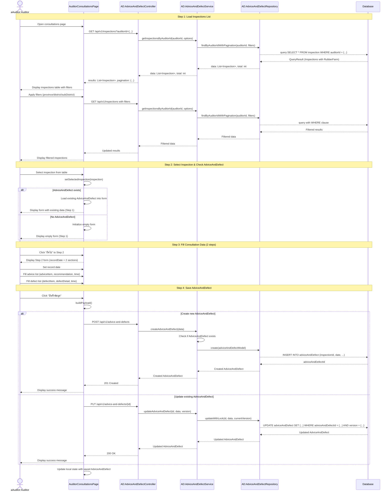

# Auditor Consultations - Sequence Diagram (High-Level)



## High-Level Overview

### Main Flow

1. **Load Inspections List** - ผู้ตรวจเข้าสู่หน้าบันทึกคำแนะนำและข้อบกพร่อง ระบบโหลดรายการการตรวจของผู้ตรวจ
2. **Select Inspection & Check AdviceAndDefect** - เลือกการตรวจ ระบบตรวจสอบว่ามีข้อมูลบันทึกไว้แล้วหรือไม่
3. **Fill Consultation Data** - กรอกข้อมูล 2 steps (วันที่บันทึก + คำแนะนำและข้อบกพร่อง)
4. **Save AdviceAndDefect** - บันทึกข้อมูล (สร้างใหม่หรืออัปเดตพร้อม optimistic locking)

### Key Components

- **AuditorConsultationsPage** - UI component สำหรับบันทึกคำแนะนำและข้อบกพร่อง (2-step form)
- **AdviceAndDefectController** - จัดการ request/response สำหรับข้อมูล AdviceAndDefect
- **AdviceAndDefectService** - Business logic สำหรับการจัดการคำแนะนำและข้อบกพร่อง
- **AdviceAndDefectRepository** - Data access layer สำหรับบันทึกข้อมูล
- **InspectionController** - ดึงรายการการตรวจของผู้ตรวจ

### Features

- Tab switching ระหว่าง "รอบันทึกข้อมูล" (in-progress) และ "บันทึกเรียบร้อย" (completed)
- Pagination และ Multi-sort สำหรับรายการการตรวจ
- Filter ตามจังหวัด/อำเภอ/ตำบล (3-level cascading)
- Multi-step form (2 steps) พร้อม progress indicator
- Dynamic form arrays สำหรับคำแนะนำและข้อบกพร่องหลายรายการ
- Optimistic Locking สำหรับ update
- Auto-load existing AdviceAndDefect into form
- JSON storage สำหรับข้อมูลที่ซับซ้อน

### Form Steps

#### Step 1: Overview

- แสดงข้อมูลการตรวจที่เลือก
- ปุ่มเริ่มบันทึกข้อมูล

#### Step 2: Consultation Data (3 sections)

1. **Record Date** (date)

   - วันที่บันทึก (Date picker)
   - Required field

2. **Advice List** (adviceList) - JSON Array

   - คำแนะนำ (adviceItem: string)
   - ข้อเสนอแนะ (recommendation: string)
   - เวลา (time: Date)
   - สามารถเพิ่มหลายรายการได้ (Add/Remove buttons)

3. **Defect List** (defectList) - JSON Array
   - ข้อบกพร่อง (defectItem: string)
   - รายละเอียดข้อบกพร่อง (defectDetail: string)
   - เวลา (time: Date)
   - สามารถเพิ่มหลายรายการได้ (Add/Remove buttons)

### Data Structure

- **AdviceAndDefect** - บันทึกคำแนะนำและข้อบกพร่อง
  - adviceAndDefectId (PK)
  - inspectionId (unique) - 1:1 relationship กับ Inspection
  - date (Date) - วันที่บันทึก
  - adviceList (JSON Array) - รายการคำแนะนำ
    ```json
    [
      {
        "adviceItem": "string",
        "recommendation": "string",
        "time": "ISO Date"
      }
    ]
    ```
  - defectList (JSON Array) - รายการข้อบกพร่อง
    ```json
    [
      {
        "defectItem": "string",
        "defectDetail": "string",
        "time": "ISO Date"
      }
    ]
    ```
  - version (int) - สำหรับ optimistic locking
  - createdAt (timestamp)
  - updatedAt (timestamp)

### Validation Rules

- inspectionId required
- date required
- ต้องเลือกการตรวจก่อนบันทึก
- AdviceAndDefect มีได้ 1 รายการต่อ 1 inspection
- version จำเป็นสำหรับ update เพื่อป้องกันการ update พร้อมกัน
- adviceList และ defectList สามารถเป็น empty array ได้

### Success Flow

- Create: แสดง success toast "สร้างข้อมูลเรียบร้อย"
- Update: แสดง success toast "บันทึกข้อมูลเรียบร้อย"
- อัปเดต local state ด้วย adviceAndDefectId และ version ใหม่
- Refresh inspections list เพื่อแสดงสถานะที่อัปเดต

### Error Handling

- AdviceAndDefect already exists → 409 Conflict
- Optimistic lock conflict → 409 Conflict with version mismatch
- Validation errors → 400 Bad Request
- No inspection selected → Show error toast
- Missing required fields → Show validation errors

### Integration Points

- **Inspection API** - GET /api/v1/inspections?auditorId={...}
- **AdviceAndDefect API** - POST /api/v1/advice-and-defects, PUT /api/v1/advice-and-defects/{id}
- **Thai Province Data** - ใช้ thai-provinces.json สำหรับ filter
- **NextAuth Session** - ระบุ auditorId จาก session.user.roleData
