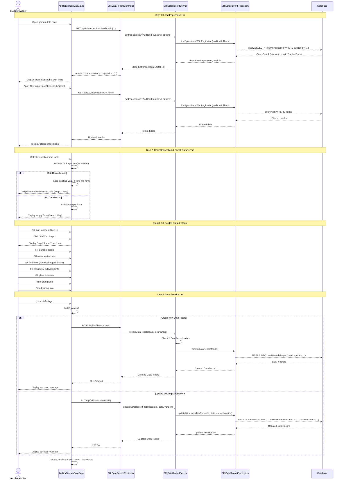

# Auditor Garden Data - Sequence Diagram (High-Level)

## High-Level Overview

### Main Flow

1. **Load Inspections List** - ผู้ตรวจเข้าสู่หน้าบันทึกข้อมูลสวน ระบบโหลดรายการการตรวจของผู้ตรวจ
2. **Select Inspection & Check DataRecord** - เลือกการตรวจ ระบบตรวจสอบว่ามีข้อมูลสวนบันทึกไว้แล้วหรือไม่
3. **Fill Garden Data** - กรอกข้อมูลสวนยาง 2 steps (Map + 7 sections)
4. **Save DataRecord** - บันทึกข้อมูล (สร้างใหม่หรืออัปเดตพร้อม optimistic locking)

### Key Components

- **AuditorGardenDataPage** - UI component สำหรับบันทึกข้อมูลสวนยาง (2-step form)
- **DataRecordController** - จัดการ request/response สำหรับข้อมูล DataRecord
- **DataRecordService** - Business logic สำหรับการจัดการข้อมูลสวน
- **DataRecordRepository** - Data access layer สำหรับบันทึกข้อมูลสวน
- **InspectionController** - ดึงรายการการตรวจของผู้ตรวจ

### Features

- Tab switching ระหว่าง "รอบันทึกข้อมูล" (in-progress) และ "บันทึกเรียบร้อย" (completed)
- Pagination และ Multi-sort สำหรับรายการการตรวจ
- Filter ตามจังหวัด/อำเภอ/ตำบล (3-level cascading)
- Multi-step form (2 steps) พร้อม progress indicator
- Interactive map สำหรับระบุตำแหน่งสวนยาง
- Dynamic form arrays สำหรับข้อมูลที่มีหลายรายการ
- Optimistic Locking สำหรับ update
- Auto-load existing DataRecord into form
- JSON storage สำหรับข้อมูลที่ซับซ้อน

### Form Steps

#### Step 1: Map Location

- แผนที่แสดงตำแหน่งสวนยาง
- แสดงพิกัด (latitude, longitude)

#### Step 2: Garden Data (7 sections)

1. **Planting Details** (species)

   - พันธุ์ยาง (specie) - dropdown
   - ระยะปลูก (spacing)
   - จำนวนต้น (numberOfTrees)
   - วันที่ปลูก (plantingDate)
   - สามารถเพิ่มหลายรายการได้

2. **Water System** (waterSystem)

   - มีระบบน้ำหรือไม่ (has: boolean)
   - รายละเอียด (details: string)

3. **Fertilizers** (fertilizers)

   - ปุ๋ยเคมี (chemical): สูตร, อัตรา, ความถี่/ปี
   - ปุ๋ยอินทรีย์/น้ำหมัก (organic): สูตร, อัตรา, ความถี่/ปี
   - อื่นๆ (other): สูตร, อัตรา, ความถี่/ปี
   - แต่ละประเภทสามารถเพิ่มหลายรายการได้

4. **Previously Cultivated** (previouslyCultivated)

   - ไม่เคยใช้ (neverUsed: boolean)
   - เคยใช้ (used: boolean)
   - พืชที่ปลูกก่อนหน้า ปีที่ 1 (year1)
   - พืชที่ปลูกก่อนหน้า ปีที่ 2 (year2)

5. **Plant Disease** (plantDisease)

   - ชื่อโรค (name)
   - ช่วงระบาด (outbreakPeriod)
   - การป้องกันและควบคุม (preventionAndControl)
   - สามารถเพิ่มหลายรายการได้

6. **Related Plants** (relatedPlants)

   - มีหรือไม่มี (toggle)
   - ชื่อพืชที่ปลูกร่วม (name)
   - สามารถเพิ่มหลายรายการได้

7. **More Info** (moreInfo)
   - ข้อมูลเพิ่มเติม (textarea)

### Data Structure

- **DataRecord** - บันทึกข้อมูลสวนยาง
  - inspectionId (unique) - 1:1 relationship กับ Inspection
  - species (JSON) - ข้อมูลการปลูก
  - waterSystem (JSON) - ระบบน้ำ
  - fertilizers (JSON) - ปุ๋ย 3 ประเภท
  - previouslyCultivated (JSON) - พืชที่เคยปลูก
  - plantDisease (JSON Array) - โรคพืช
  - relatedPlants (JSON Array) - พืชที่ปลูกร่วม
  - moreInfo (string) - ข้อมูลเพิ่มเติม
  - map (JSON) - ตำแหน่งแผนที่
  - version (int) - สำหรับ optimistic locking

### Validation Rules

- inspectionId required
- ต้องเลือกการตรวจก่อนบันทึก
- DataRecord มีได้ 1 รายการต่อ 1 inspection
- version จำเป็นสำหรับ update เพื่อป้องกันการ update พร้อมกัน

### Success Flow

- Create: แสดง success toast "สร้างข้อมูลเรียบร้อย"
- Update: แสดง success toast "บันทึกข้อมูลเรียบร้อย"
- อัปเดต local state ด้วย dataRecordId และ version ใหม่
- Refresh inspections list เพื่อแสดงสถานะที่อัปเดต

### Error Handling

- DataRecord already exists → 409 Conflict
- Optimistic lock conflict → 409 Conflict with version mismatch
- Validation errors → 400 Bad Request
- No inspection selected → Show error toast

### Integration Points

- **Inspection API** - GET /api/v1/inspections?auditorId={...}
- **DataRecord API** - POST /api/v1/data-records, PUT /api/v1/data-records/{id}
- **Thai Province Data** - ใช้ thai-provinces.json สำหรับ filter
- **NextAuth Session** - ระบุ auditorId จาก session.user.roleData
