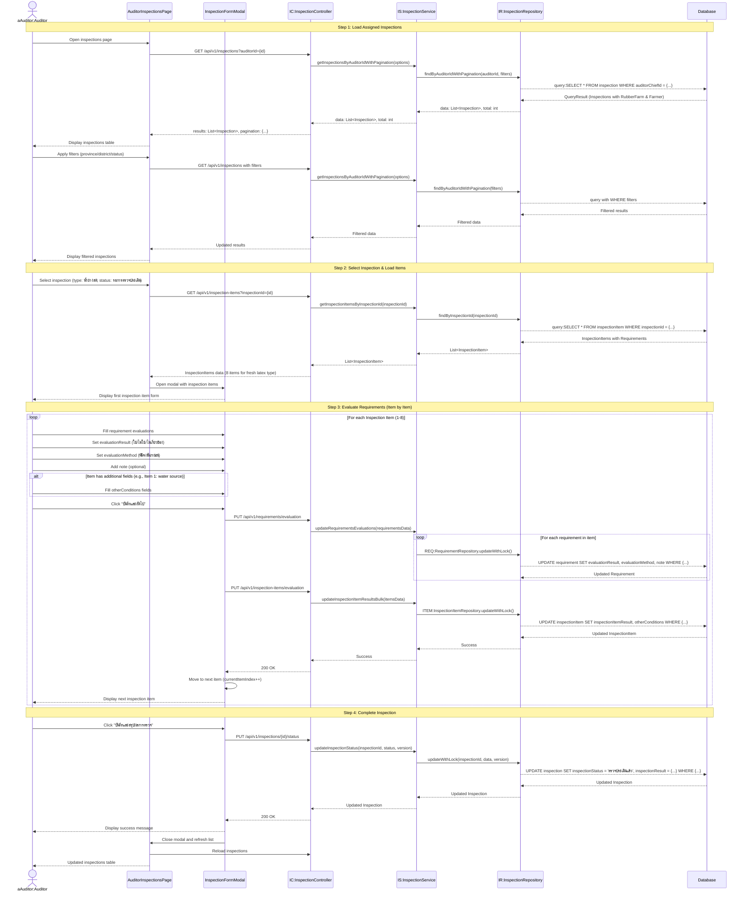

# Auditor Inspections - Post-Tapping Fresh Latex (ตรวจประเมินสวนยางพาราหลังเปิดกรีดและการผลิตน้ำยางสด) - Sequence Diagram (High-Level)

## High-Level Overview

### Main Flow

1. **Load Assigned Inspections** - ผู้ตรวจโหลดรายการการตรวจที่ได้รับมอบหมาย กรองได้ตามพื้นที่และสถานะ
2. **Select Inspection & Load Items** - เลือกการตรวจประเภท "น้ำยางสด" ที่มีสถานะ "รอการตรวจประเมิน" และโหลดรายการตรวจ
3. **Evaluate Requirements (Item by Item)** - ประเมินข้อกำหนดในแต่ละรายการตรวจทีละรายการ บันทึกผลการประเมิน
4. **Complete Inspection** - เมื่อประเมินครบทุกรายการแล้ว สรุปผลและเปลี่ยนสถานะเป็น "ตรวจประเมินแล้ว"

### Key Components

- **AuditorInspectionsPage** - UI component สำหรับแสดงรายการการตรวจของผู้ตรวจ
- **InspectionFormModal** - Modal component สำหรับฟอร์มประเมินแต่ละรายการตรวจ
- **InspectionController** - จัดการ request/response สำหรับการตรวจ
- **InspectionService** - Business logic สำหรับการจัดการการตรวจ
- **InspectionItemController** - จัดการรายการตรวจ (inspection items)
- **RequirementController** - จัดการข้อกำหนด (requirements)
- **useInspectionForm Hook** - Custom hook สำหรับจัดการ state ของฟอร์มการตรวจ

### Features

- Pagination และ Multi-sort สำหรับรายการการตรวจ
- Filter ตามจังหวัด/อำเภอ/ตำบล และสถานะการตรวจ
- แสดงข้อมูลการตรวจ: เลขที่, วันที่นัดตรวจ, ประเภทการตรวจ, สถานที่, เกษตรกร, สถานะ
- ดูรายละเอียดสวนยางในโมดอล (map + planting details)
- Multi-step form สำหรับประเมินรายการตรวจทีละรายการ
- Progress indicator แสดงรายการที่กำลังประเมิน
- Auto-save position (localStorage) เพื่อกลับมาทำต่อได้
- Optimistic locking สำหรับ concurrent updates
- Validation ก่อนบันทึก (ต้องประเมินทุก requirement ในรายการ)

### Inspection Item Result Logic

ผลการตรวจของแต่ละรายการตรวจ (inspectionItemResult) คำนวณจาก:

- **ผ่าน** - ทุก requirement เป็น "ใช่" หรือ "ไม่เกี่ยวข้อง"
- **ไม่ผ่าน** - มี requirement ใดๆ เป็น "ไม่ใช่"
- **Automatic calculation** - ระบบคำนวณอัตโนมัติจาก requirements

### Overall Inspection Result Logic

ผลการตรวจโดยรวม (inspectionResult) คำนวณจาก:

- **ผ่าน** - ทุก inspection item เป็น "ผ่าน"
- **ไม่ผ่าน** - มี inspection item ใดๆ เป็น "ไม่ผ่าน"
- **Automatic calculation** - ระบบคำนวณอัตโนมัติเมื่อสรุปผลการตรวจ

### Validation Rules

- ต้องประเมิน requirement ทุกตัวในแต่ละรายการก่อนไปรายการถัดไป
- evaluationResult และ evaluationMethod เป็น required fields
- note เป็น optional field
- otherConditions fields ไม่บังคับแต่แนะนำให้กรอก

### Database Transaction

- Update all requirements in inspection item (bulk update)
- Update inspection item result and otherConditions
- Both operations with optimistic locking (version control)
- Final step: Update inspection status and result

### Success Flow

- แสดง success message หลังบันทึกแต่ละรายการ
- Progress indicator อัพเดท
- เมื่อครบทุกรายการ แสดงปุ่ม "บันทึกและสรุปผลการตรวจ"
- สรุปผลการตรวจ → อัพเดทสถานะเป็น "ตรวจประเมินแล้ว"
- ปิด modal และ refresh รายการการตรวจ

### Integration Points

- **NextAuth Session** - ระบุ auditorId สำหรับ filter inspections
- **Thai Province Data** - ใช้ thai-provinces.json สำหรับ filter
- **Inspection API** - GET /api/v1/inspections?auditorId={id}
- **InspectionItem API** - GET /api/v1/inspection-items?inspectionId={id}
- **Requirement API** - PUT /api/v1/requirements/evaluation (bulk update)
- **InspectionItem API** - PUT /api/v1/inspection-items/evaluation (bulk update)
- **Inspection Status API** - PUT /api/v1/inspections/{id}/status
- **RubberFarm API** - GET /api/v1/rubber-farms/{id} (for farm details modal)

### State Management

- `inspectionItems` - Array of inspection items with requirements
- `currentItemIndex` - Current item being evaluated
- `saving` - Loading state during save operation
- `localStorage` - Save progress position for resuming later

### Auto-save Position

- Save current position to localStorage: `inspection_{inspectionId}_position`
- Resume from saved position when reopening inspection
- Clear saved position after completing inspection
