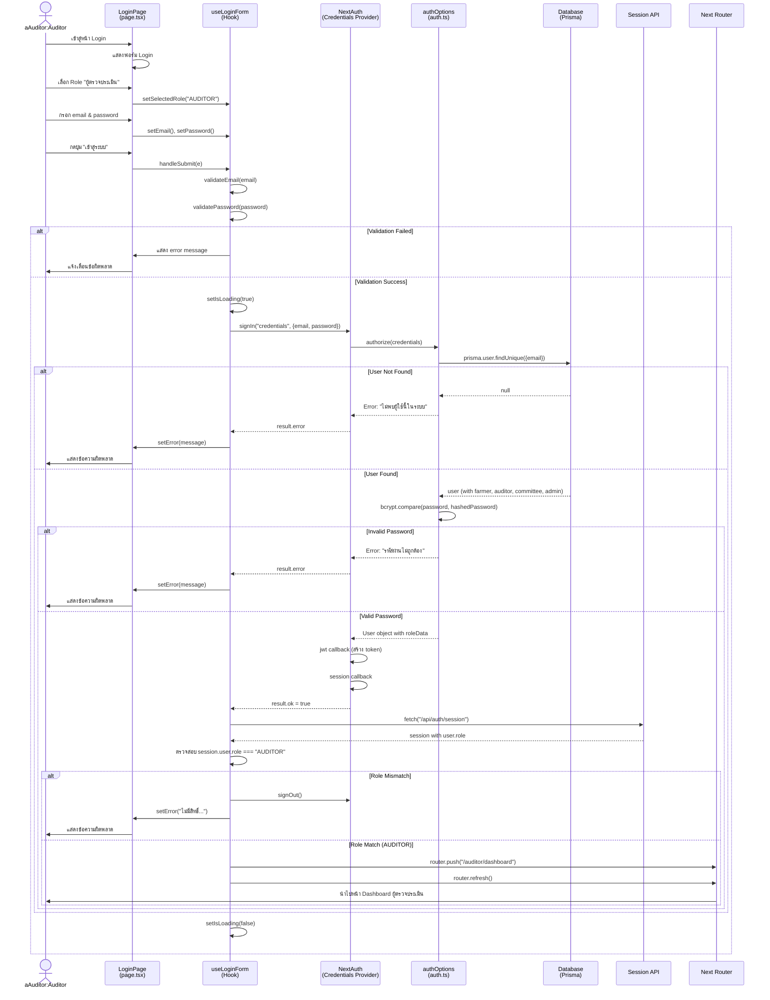

```mermaid
sequenceDiagram
    actor Auditor as aAuditor:Auditor
    participant UI as LoginPage<br/>(page.tsx)
    participant Hook as useLoginForm<br/>(Hook)
    participant NextAuth as NextAuth<br/>(Credentials Provider)
    participant Auth as authOptions<br/>(auth.ts)
    participant DB as Database<br/>(Prisma)
    participant Session as Session API
    participant Router as Next Router

    Auditor->>UI: เข้าสู่หน้า Login
    UI->>UI: แสดงฟอร์ม Login

    Auditor->>UI: เลือก Role "ผู้ตรวจประเมิน"
    UI->>Hook: setSelectedRole("AUDITOR")

    Auditor->>UI: กรอก email & password
    UI->>Hook: setEmail(), setPassword()

    Auditor->>UI: กดปุ่ม "เข้าสู่ระบบ"
    UI->>Hook: handleSubmit(e)

    Hook->>Hook: validateEmail(email)
    Hook->>Hook: validatePassword(password)

    alt Validation Failed
        Hook->>UI: แสดง error message
        UI->>Auditor: แจ้งเตือนข้อผิดพลาด
    else Validation Success
        Hook->>Hook: setIsLoading(true)
        Hook->>NextAuth: signIn("credentials", {email, password})

        NextAuth->>Auth: authorize(credentials)
        Auth->>DB: prisma.user.findUnique({email})

        alt User Not Found
            DB-->>Auth: null
            Auth-->>NextAuth: Error: "ไม่พบผู้ใช้นี้ในระบบ"
            NextAuth-->>Hook: result.error
            Hook->>UI: setError(message)
            UI->>Auditor: แสดงข้อความผิดพลาด
        else User Found
            DB-->>Auth: user (with farmer, auditor, committee, admin)
            Auth->>Auth: bcrypt.compare(password, hashedPassword)

            alt Invalid Password
                Auth-->>NextAuth: Error: "รหัสผ่านไม่ถูกต้อง"
                NextAuth-->>Hook: result.error
                Hook->>UI: setError(message)
                UI->>Auditor: แสดงข้อความผิดพลาด
            else Valid Password
                Auth-->>NextAuth: User object with roleData
                NextAuth->>NextAuth: jwt callback (สร้าง token)
                NextAuth->>NextAuth: session callback
                NextAuth-->>Hook: result.ok = true

                Hook->>Session: fetch("/api/auth/session")
                Session-->>Hook: session with user.role

                Hook->>Hook: ตรวจสอบ session.user.role === "AUDITOR"

                alt Role Mismatch
                    Hook->>NextAuth: signOut()
                    Hook->>UI: setError("ไม่มีสิทธิ์...")
                    UI->>Auditor: แสดงข้อความผิดพลาด
                else Role Match (AUDITOR)
                    Hook->>Router: router.push("/auditor/dashboard")
                    Hook->>Router: router.refresh()
                    Router->>Auditor: นำไปหน้า Dashboard ผู้ตรวจประเมิน
                end
            end
        end
        Hook->>Hook: setIsLoading(false)
    end
```
