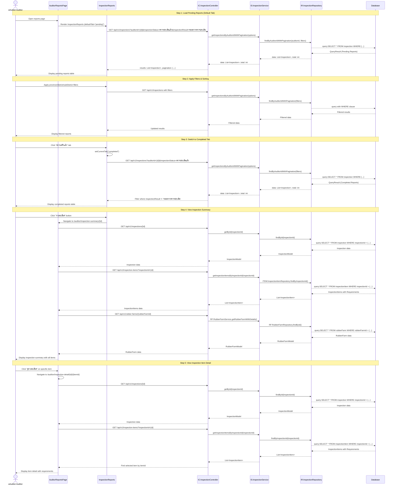

# Auditor Reports - Sequence Diagram (High-Level)

## High-Level Overview

### Main Flow

1. **Load Pending Reports** - ผู้ตรวจโหลดรายการสรุปผลที่รอการสรุป (ตรวจเสร็จแล้วแต่ยังไม่สรุปผล)
2. **Apply Filters & Sorting** - กรองตามพื้นที่และเรียงลำดับข้อมูล
3. **Switch to Completed Tab** - สลับไปดูรายการที่สรุปผลเรียบร้อยแล้ว
4. **View Inspection Summary** - เปิดดูสรุปผลการตรวจแต่ละรายการ (ทุกรายการตรวจ)
5. **View Inspection Item Detail** - เปิดดูรายละเอียดแต่ละรายการตรวจ (requirements ทั้งหมด)

### Key Components

- **AuditorReportsPage** - Page component สำหรับหน้ารายงาน
- **InspectionReports** - Shared component สำหรับแสดงรายงานการตรวจ (ใช้ร่วมกับ Committee)
- **InspectionSummaryContent** - Shared component สำหรับสรุปผลการตรวจ
- **InspectionDetailContent** - Shared component สำหรับรายละเอียดรายการตรวจ
- **InspectionController** - จัดการ request/response สำหรับการตรวจ
- **InspectionService** - Business logic สำหรับการจัดการการตรวจ
- **useInspectionReports Hook** - Custom hook สำหรับจัดการ state ของรายงาน
- **useInspectionSummary Hook** - Custom hook สำหรับดึงข้อมูลสรุปผล
- **useInspectionDetail Hook** - Custom hook สำหรับดึงข้อมูลรายละเอียด

### Features

- **Tab Navigation** - สลับระหว่าง "รอสรุปผล" และ "ตรวจเสร็จแล้ว"
- Pagination และ Multi-sort สำหรับรายการรายงาน
- Filter ตามจังหวัด/อำเภอ/ตำบล
- แสดงข้อมูลการตรวจ: รหัสการตรวจ, เกษตรกร, สถานที่, วันที่ตรวจ, สถานะ
- View inspection summary (ทุกรายการตรวจในการตรวจครั้งนั้น)
- View inspection item detail (รายละเอียดทุก requirement ในรายการ)
- Status badge แสดงผลการตรวจ (ผ่าน/ไม่ผ่าน/รอผล)

### Report Tabs

#### Tab 1: รอสรุปผล (Pending)

- **Filter**: `inspectionStatus = "ตรวจประเมินแล้ว"` AND `inspectionResult = "รอผลการตรวจประเมิน"`
- แสดงการตรวจที่ตรวจเสร็จแล้ว แต่ยังไม่ได้สรุปผลโดยคณะกรรมการ
- ผู้ตรวจสามารถดูรายละเอียดเพื่อตรวจสอบผลการประเมิน

#### Tab 2: ตรวจเสร็จแล้ว (Completed)

- **Filter**: `inspectionStatus = "ตรวจประเมินแล้ว"` AND `inspectionResult != "รอผลการตรวจประเมิน"`
- แสดงการตรวจที่สรุปผลเรียบร้อยแล้ว (ผ่าน/ไม่ผ่าน)
- ใช้สำหรับตรวจสอบประวัติการตรวจ

### Inspection Summary Page

แสดงสรุปภาพรวมการตรวจ 1 ครั้ง ประกอบด้วย:

1. **Inspection Information**

   - รหัสการตรวจ (inspectionNo)
   - วันที่ตรวจ (inspectionDateAndTime)
   - ประเภทการตรวจ (inspectionType)
   - สถานะ (inspectionStatus)
   - ผลการตรวจ (inspectionResult)

2. **Rubber Farm Information**

   - สถานที่สวนยาง (villageName, district, province)
   - ข้อมูลเกษตรกร (namePrefix, firstName, lastName)

3. **Inspection Items Table**

   - แสดงรายการตรวจทั้งหมด
   - inspectionItemNo, itemName, inspectionItemResult
   - ปุ่ม "ดูรายละเอียด" สำหรับแต่ละรายการ

4. **Requirements Summary** (calculated)
   - จำนวนข้อกำหนดทั้งหมด
   - จำนวนข้อกำหนดหลักที่ผ่าน/ไม่ผ่าน
   - จำนวนข้อกำหนดรองที่ผ่าน/ไม่ผ่าน

### Inspection Detail Page

แสดงรายละเอียดรายการตรวจ 1 รายการ ประกอบด้วย:

1. **Inspection & Item Header**

   - ข้อมูลการตรวจ (รหัส, วันที่, ประเภท, สถานที่)
   - ชื่อรายการตรวจ (itemName)
   - ผลการตรวจรายการนี้ (inspectionItemResult)

2. **Additional Fields** (ถ้ามี)

   - Item 1: แหล่งน้ำที่ใช้ (waterSourceInPlantation, waterSourcePostHarvest)
   - Item 2: ลักษณะพื้นที่ปลูก (landConditions)
   - Item 3: ไม่ใช้วัตถุอันตราย (notUsingHazardous checkbox)

3. **Requirements Details**
   - แสดงทุก requirement ในรายการนั้น
   - requirementNo, requirementName
   - evaluationResult (ผ่าน/ไม่ผ่าน/ไม่เกี่ยวข้อง)
   - evaluationMethod (สัมภาษณ์/สังเกต/ตรวจสอบเอกสาร/ตรวจวิเคราะห์)
   - note (ข้อสังเกต)

### Status Badge Logic

แสดงสถานะด้วยสี:

- **รอผลการตรวจประเมิน** - สีเหลือง (yellow badge)
- **ผ่าน** - สีเขียว (green badge)
- **ไม่ผ่าน** - สีแดง (red badge)

### Data Flow

1. **Reports List** → Load inspections with filters
2. **Click Detail** → Navigate to Summary page → Load inspection + items + farm
3. **Click Item Detail** → Navigate to Detail page → Load inspection + find specific item
4. **Back to Reports** → Router.back() or navigate to /auditor/reports

### Validation Rules

- ต้อง authenticate เป็น AUDITOR role
- ต้องมี auditorId ใน session.user.roleData
- Filter เฉพาะการตรวจที่เกี่ยวข้องกับผู้ตรวจคนนั้น

### Integration Points

- **NextAuth Session** - ระบุ auditorId สำหรับ filter
- **Thai Province Data** - ใช้ thai-provinces.json สำหรับ filter
- **Inspection API** - GET /api/v1/inspections?auditorId={id}
- **InspectionItem API** - GET /api/v1/inspection-items?inspectionId={id}
- **RubberFarm API** - GET /api/v1/rubber-farms/{id}
- **Farmer API** - GET /api/v1/farmers/{id}
- **InspectionType API** - GET /api/v1/inspections/types

### State Management

#### useInspectionReports Hook

- `inspections` - Array of inspection reports
- `currentTab` - "pending" | "completed"
- `filters` - Province, district, subDistrict
- `lazyParams` - Pagination and sorting
- `loading` - Loading state

#### useInspectionSummary Hook

- `inspection` - Inspection with items array
- `selectedResult` - PASS | FAIL (auto-calculated)
- `loading` - Loading state
- `savingResult` - Saving state (for committee to submit final result)

#### useInspectionDetail Hook

- `inspection` - Inspection data
- `inspectionItem` - Selected inspection item with requirements
- `loading` - Loading state

### Pagination & Sorting

- Rows per page: 10, 25, 50
- Multi-sort support
- Server-side pagination
- Total records from paginator

### Success Flow

- Load reports → Apply filters → View summary → View details
- Navigate between pages seamlessly
- Back button returns to previous page
- All data fetched on demand
