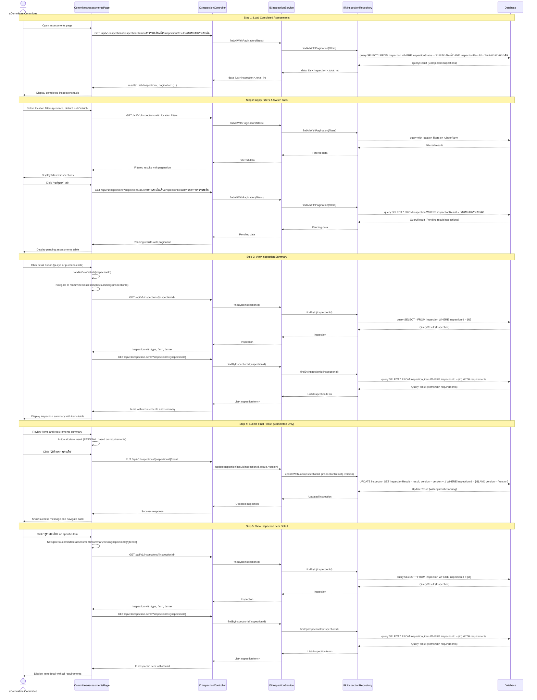

# Committee Assessments - Sequence Diagram (High-Level)

## High-Level Overview

### Main Flow

1. **Load Completed Assessments** - คณะกรรมการโหลดรายการการตรวจที่สรุปผลเรียบร้อยแล้ว (เริ่มต้นที่แท็บ "ตรวจเสร็จแล้ว")
2. **Apply Filters & Switch Tabs** - กรองตามพื้นที่และสลับไปดูรายการที่รอสรุปผล
3. **View Inspection Summary** - เปิดดูสรุปผลการตรวจ พร้อมรายการตรวจทั้งหมด
4. **Submit Final Result** - คณะกรรมการสรุปผลการตรวจ (ผ่าน/ไม่ผ่าน) สำหรับรายการที่รอสรุปผล
5. **View Inspection Item Detail** - เปิดดูรายละเอียดแต่ละรายการตรวจ (requirements ทั้งหมด)

### Key Components

- **CommitteeAssessmentsPage** - Page component สำหรับหน้าพิจารณาผลการตรวจประเมิน
- **InspectionReports** - Shared component สำหรับแสดงรายงานการตรวจ (ใช้ร่วมกับ Auditor)
- **InspectionSummaryContent** - Shared component สำหรับสรุปผลการตรวจ (พร้อมฟังก์ชันบันทึกผล)
- **InspectionDetailContent** - Shared component สำหรับรายละเอียดรายการตรวจ
- **InspectionController** - จัดการ request/response สำหรับการตรวจ
- **InspectionService** - Business logic สำหรับการจัดการการตรวจ
- **useInspectionReports Hook** - Custom hook สำหรับจัดการ state ของรายงาน
- **useInspectionSummary Hook** - Custom hook สำหรับดึงข้อมูลสรุปผล และบันทึกผล
- **useInspectionDetail Hook** - Custom hook สำหรับดึงข้อมูลรายละเอียด

### Features

- **Tab Navigation** - สลับระหว่าง "ตรวจเสร็จแล้ว" (default) และ "รอสรุปผล"
- Pagination และ Multi-sort สำหรับรายการรายงาน
- Filter ตามจังหวัด/อำเภอ/ตำบล
- แสดงข้อมูลการตรวจ: รหัสการตรวจ, เกษตรกร, สถานที่, วันที่ตรวจ, สถานะ
- View inspection summary (ทุกรายการตรวจในการตรวจครั้งนั้น)
- **Submit final result** (เฉพาะคณะกรรมการ) - บันทึกผลการตรวจ (ผ่าน/ไม่ผ่าน)
- View inspection item detail (รายละเอียดทุก requirement ในรายการ)
- Status badge แสดงผลการตรวจ (ผ่าน/ไม่ผ่าน/รอผล)
- Auto-calculation of pass/fail based on requirements compliance

### Assessment Tabs

#### Tab 1: ตรวจเสร็จแล้ว (Completed) - DEFAULT

- **Filter**: `inspectionStatus = "ตรวจประเมินแล้ว"` AND `inspectionResult != "รอผลการตรวจประเมิน"`
- แสดงการตรวจที่คณะกรรมการสรุปผลเรียบร้อยแล้ว (ผ่าน/ไม่ผ่าน)
- ใช้สำหรับตรวจสอบประวัติการตรวจและผลการประเมิน
- ปุ่ม action: pi-eye (ดูรายละเอียด)

#### Tab 2: รอสรุปผล (Pending)

- **Filter**: `inspectionStatus = "ตรวจประเมินแล้ว"` AND `inspectionResult = "รอผลการตรวจประเมิน"`
- แสดงการตรวจที่ผู้ตรวจเสร็จแล้ว แต่ยังไม่ได้สรุปผลโดยคณะกรรมการ
- คณะกรรมการต้องเข้ามาพิจารณาและบันทึกผลการตรวจ
- ปุ่ม action: pi-check-circle สีเขียว (สรุปผล)

### Inspection Summary Page

แสดงสรุปภาพรวมการตรวจ 1 ครั้ง ประกอบด้วย:

1. **Inspection Information**

   - รหัสการตรวจ (inspectionNo)
   - วันที่ตรวจ (inspectionDateAndTime)
   - ประเภทการตรวจ (inspectionType.typeName)
   - สถานะ (inspectionStatus)
   - ผลการตรวจ (inspectionResult)

2. **Rubber Farm Information**

   - ข้อมูลสวนยาง (villageName, district, province)
   - ข้อมูลเกษตรกร (namePrefix, firstName, lastName)

3. **Inspection Items Table**

   - ลำดับรายการ (inspectionItemNo)
   - ชื่อรายการ (itemName)
   - ผลการประเมิน (inspectionItemResult)
   - ปุ่ม "ดูรายละเอียด" สำหรับแต่ละรายการ

4. **Requirements Summary** (calculated)

   - จำนวนข้อกำหนดหลักทั้งหมด / ผ่าน / ไม่ผ่าน
   - จำนวนข้อกำหนดรองทั้งหมด / ผ่าน / ไม่ผ่าน
   - เปอร์เซ็นต์ความสอดคล้องของข้อกำหนดรอง
   - **Auto-calculated result**: ผ่าน (ถ้าข้อกำหนดหลักผ่านทั้งหมด และข้อกำหนดรองผ่าน ≥ 60%)

5. **Submit Final Result Section** (เฉพาะคณะกรรมการ)
   - แสดง radio buttons: ผ่าน / ไม่ผ่าน (auto-selected based on calculation)
   - ปุ่ม "บันทึกผลการประเมิน" (เฉพาะรายการที่รอสรุปผล)
   - Optimistic locking สำหรับการอัปเดตผล

### Inspection Detail Page

แสดงรายละเอียดรายการตรวจ 1 รายการ ประกอบด้วย:

1. **Inspection & Item Header**

   - รหัสการตรวจ (inspectionNo)
   - ชื่อรายการตรวจ (itemName)
   - ผลการตรวจรายการนี้ (inspectionItemResult)

2. **Additional Fields** (ถ้ามี)

   - Item 1 (น้ำ): waterSource, waterReservoir
   - Item 2 (พื้นที่ปลูก): landConditions (array with other option)
   - Item 3: ไม่ใช้วัตถุอันตราย (notUsingHazardous checkbox)

3. **Requirements Details**
   - แสดงทุก requirement ในรายการนั้น (เรียงตาม requirementNo)
   - requirementName, requirementLevel (หลัก/รอง)
   - evaluationResult (ใช่/ไม่ใช่)
   - evaluationMethod (วิธีการประเมิน)
   - note (ข้อสังเกต)

### Pass/Fail Calculation Logic

คณะกรรมการจะพิจารณาผลการตรวจตาม logic:

1. **Main Requirements (ข้อกำหนดหลัก)**

   - ต้องผ่านทุกข้อ (evaluationResult = "ใช่")
   - ถ้ามีข้อใดข้อหนึ่งไม่ผ่าน → ไม่ผ่านการตรวจ

2. **Secondary Requirements (ข้อกำหนดรอง)**

   - ต้องผ่านอย่างน้อย 60% ของข้อกำหนดรองทั้งหมด
   - Compliance % = (Secondary Passed / Secondary Total) × 100

3. **Final Result**
   - **ผ่าน**: Main Requirements ผ่านทุกข้อ AND Secondary Requirements ≥ 60%
   - **ไม่ผ่าน**: Main Requirements ไม่ผ่าน OR Secondary Requirements < 60%

### Status Badge Logic

แสดงสถานะด้วยสี:

- **รอผลการตรวจประเมิน** - สีเหลือง (yellow badge)
- **ผ่าน** - สีเขียว (green badge)
- **ไม่ผ่าน** - สีแดง (red badge)

### Data Flow

1. **Assessments List** → Load inspections (default: completed)
2. **Click Detail/Submit** → Navigate to Summary page → Load inspection + items + farm
3. **Review Summary** → Auto-calculate result → Submit final result (if pending)
4. **Click Item Detail** → Navigate to Detail page → Load inspection + find specific item
5. **Back to Assessments** → Router.back() or navigate to /committee/assessments

### Validation Rules

- ต้อง authenticate เป็น COMMITTEE หรือ ADMIN role
- ไม่ต้องกรองตาม committeeId (committee ดูได้ทุกรายการ)
- เฉพาะรายการที่ inspectionResult = "รอผลการตรวจประเมิน" เท่านั้นที่แสดงปุ่มบันทึกผล
- Optimistic locking สำหรับการอัปเดตผลการตรวจ (ใช้ version field)

### Submit Final Result Process

1. คณะกรรมการเปิดดูสรุปผลการตรวจ
2. ระบบคำนวณผลอัตโนมัติตาม requirements
3. แสดง radio buttons พร้อม pre-select ผลที่คำนวณได้
4. คณะกรรมการสามารถเปลี่ยนผลได้ (override)
5. คลิก "บันทึกผลการประเมิน"
6. ระบบอัปเดต inspectionResult ด้วย optimistic locking
7. Success → แสดง toast message และ navigate กลับไปหน้า assessments
8. Conflict (409) → แสดง error และให้ reload page

### Integration Points

- **NextAuth Session** - ระบุ role (COMMITTEE or ADMIN) สำหรับ authorization
- **Thai Province Data** - ใช้ thai-provinces.json สำหรับ filter
- **Inspection API** - GET /api/v1/inspections (with filters)
- **Inspection Result API** - PUT /api/v1/inspections/{id}/result (committee only)
- **InspectionItem API** - GET /api/v1/inspection-items?inspectionId={id}
- **RubberFarm API** - GET /api/v1/rubber-farms/{id}
- **Farmer API** - GET /api/v1/farmers/{id}
- **InspectionType API** - GET /api/v1/inspections/types

### State Management

#### useInspectionReports Hook

- `inspections` - Array of inspection reports
- `currentTab` - "pending" | "completed" (default: "completed")
- `filters` - Province, district, subDistrict
- `lazyParams` - Pagination and sorting
- `loading` - Loading state

#### useInspectionSummary Hook

- `inspection` - Inspection with items array
- `selectedResult` - PASS | FAIL (auto-calculated, can be overridden)
- `loading` - Loading state
- `savingResult` - Saving state for committee to submit final result

#### useInspectionDetail Hook

- `inspection` - Inspection data
- `inspectionItem` - Selected inspection item with requirements
- `loading` - Loading state

### Pagination & Sorting

- Rows per page: 10, 25, 50
- Multi-sort support
- Server-side pagination
- Total records from paginator

### Success Flow

- Load assessments (completed by default) → Apply filters → Switch to pending tab
- View summary → Review requirements → Submit final result
- Navigate to item details → Review all requirements → Back to summary

### Error Handling

- Unauthorized → 401/403 redirect to login
- Inspection not found → 404 Not Found
- Version conflict (optimistic lock) → 409 Conflict, show error and reload
- Validation errors → Show error toast
- Failed to fetch → Show empty table with error console log

### Business Logic

- คณะกรรมการดูรายการตรวจทั้งหมด (ไม่จำกัดเฉพาะผู้ตรวจคนใด)
- Default tab เป็น "ตรวจเสร็จแล้ว" เพื่อดูประวัติการตรวจ
- แท็บ "รอสรุปผล" สำหรับรายการที่ต้องการความสนใจ
- Auto-calculation ช่วยให้คณะกรรมการตัดสินใจได้ง่ายขึ้น
- คณะกรรมการสามารถ override ผลการคำนวณได้ (ในกรณีพิเศษ)
- Optimistic locking ป้องกันการอัปเดตซ้อนทับกัน

### Authorization

- Required roles: COMMITTEE or ADMIN
- Committee can view all inspections (no filter by committeeId)
- Only committee can submit final result
- Auditor role cannot access this page (redirected)

### UI Behavior

- Initial load shows "ตรวจเสร็จแล้ว" tab (completed assessments)
- Location filters persist across tab switches
- Tab switching resets pagination to first page
- Applying filters resets pagination to first page
- Loading state shows during data fetching
- Different action buttons based on tab:
  - "ตรวจเสร็จแล้ว": pi-eye (info color) - View only
  - "รอสรุปผล": pi-check-circle (success color) - Submit result
- Toast notifications for success/error feedback
- Optimistic locking prevents concurrent updates

### Performance Considerations

- Lazy loading (server-side pagination) for large datasets
- Location filters reduce query scope
- Multi-sort processed on server-side
- Requirements summary calculated client-side (from fetched data)
- Pagination state managed efficiently with useCallback
- Minimal re-renders with useMemo for columns
- Shared components (InspectionReports, InspectionSummaryContent, InspectionDetailContent) reduce code duplication
