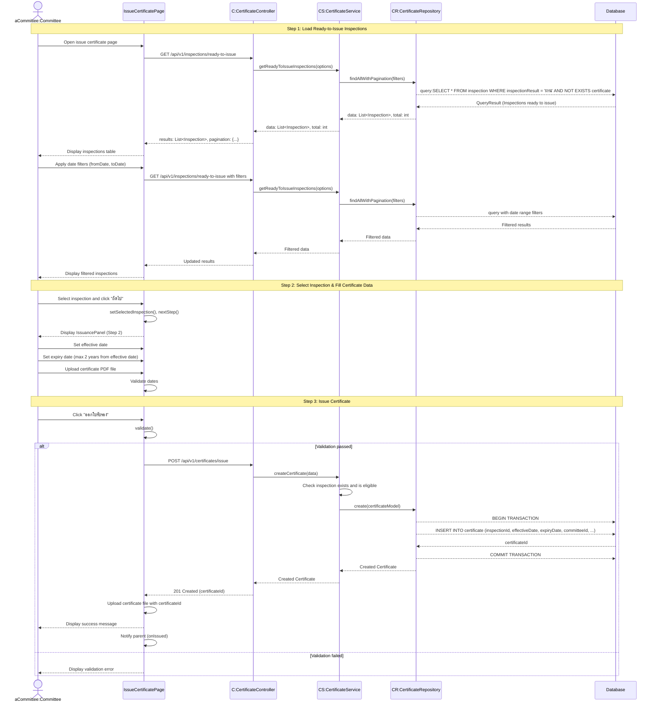

# Committee Certifications Issue - Sequence Diagram (High-Level)

## High-Level Overview

### Main Flow

1. **Load Ready-to-Issue Inspections** - คณะกรรมการเข้าสู่หน้าออกใบรับรอง ระบบโหลดรายการการตรวจที่ผ่านและพร้อมออกใบรับรอง
2. **Select Inspection & Fill Certificate Data** - เลือกการตรวจ กำหนดวันที่มีผลและหมดอายุ และอัปโหลดไฟล์ใบรับรอง
3. **Issue Certificate** - ออกใบรับรอง ระบบบันทึกข้อมูลใบรับรองและเชื่อมโยงกับไฟล์

### Key Components

- **IssueCertificatePage** - UI component สำหรับออกใบรับรอง (2-step process)
- **IssuancePanel** - Component สำหรับกรอกข้อมูลใบรับรองและอัปโหลดไฟล์
- **CertificateController** - จัดการ request/response สำหรับการออกใบรับรอง
- **CertificateService** - Business logic สำหรับการสร้างใบรับรอง
- **CertificateRepository** - Data access layer สำหรับบันทึกข้อมูลใบรับรอง
- **InspectionController** - ดึงรายการการตรวจที่พร้อมออกใบรับรอง

### Features

- Pagination และ Multi-sort สำหรับรายการการตรวจ
- Date range filter (fromDate, toDate) สำหรับกรองการตรวจ
- 2-step wizard พร้อม step indicator
- Date validation (expiry date ≤ effective date + 2 years)
- PDF file upload สำหรับใบรับรอง (max 10 MB)
- Session-based committee tracking (committeeId from NextAuth)
- Transaction-based certificate creation

### Step Details

#### Step 1: Select Inspection

- แสดงตาราง Inspections ที่พร้อมออกใบรับรอง
- Filter criteria:
  - inspectionResult = "ผ่าน"
  - ยังไม่มี Certificate (NOT EXISTS)
- แสดงข้อมูล: รหัสการตรวจ, วันที่ตรวจ, สถานที่, เกษตรกร, หัวหน้าผู้ตรวจ
- Date range filter (fromDate, toDate)
- Pagination: 10, 25, 50 rows per page
- Multi-sort support
- Select inspection → Next

#### Step 2: Issue Certificate

- กรอกข้อมูลใบรับรอง:
  - **Effective Date** (วันที่มีผล)
    - Min: Inspection date
    - Max: Expiry date (if set)
  - **Expiry Date** (วันที่หมดอายุ)
    - Min: Effective date
    - Max: Effective date + 2 years
  - **Certificate File** (ไฟล์ใบรับรอง PDF)
    - Accept: application/pdf
    - Max size: 10 MB
    - Single file only
- Validation:
  - Effective date required
  - Expiry date required
  - Expiry date ≥ Effective date
  - Expiry date ≤ Effective date + 2 years
- Submit → Issue certificate

### Data Structure

- **Certificate** - ใบรับรองแหล่งผลิต
  - certificateId (PK)
  - inspectionId (unique FK) - 1:1 relationship
  - effectiveDate (Date) - วันที่มีผล
  - expiryDate (Date) - วันที่หมดอายุ
  - activeFlag (boolean) - สถานะใช้งาน
  - cancelRequestFlag (boolean) - สถานะขอยกเลิก
  - cancelRequestDetail (string) - รายละเอียดการยกเลิก
  - committeeId (FK) - คณะกรรมการที่ออก
  - version (int) - สำหรับ optimistic locking
  - createdAt (timestamp)
  - updatedAt (timestamp)

### Validation Rules

- inspectionId required
- effectiveDate required
- expiryDate required
- expiryDate must be ≥ effectiveDate
- expiryDate must be ≤ effectiveDate + 2 years
- Inspection must have inspectionResult = "ผ่าน"
- Inspection must not already have a certificate
- Only COMMITTEE or ADMIN can issue certificates

### Business Logic

- Certificate สามารถออกได้เฉพาะการตรวจที่ผ่าน (inspectionResult = "ผ่าน")
- แต่ละ Inspection สามารถมี Certificate ได้เพียง 1 ใบ (1:1 relationship)
- ใบรับรองมีอายุสูงสุด 2 ปี
- Committee ที่ออกใบรับรองจะถูกบันทึกไว้ (committeeId from session)
- Certificate เริ่มต้นด้วย activeFlag = true, cancelRequestFlag = false

### Certificate Lifecycle

1. **Issued** - ออกใบรับรองใหม่ (activeFlag=true, cancelRequestFlag=false)
2. **Cancel Requested** - เกษตรกรยื่นขอยกเลิก (activeFlag=true, cancelRequestFlag=true)
3. **Cancelled** - คณะกรรมการอนุมัติยกเลิก (activeFlag=false, cancelRequestFlag=true)

### Success Flow

- แสดง success message หลังออกใบรับรองสำเร็จ
- อัปโหลดไฟล์ PDF ไปยัง File storage พร้อม certificateId
- Notify parent component (onIssued callback)
- Redirect หรือ refresh data

### Error Handling

- Inspection not found → 404 Not Found
- Inspection not eligible (not passed or already has certificate) → 400 Bad Request
- Validation errors → Show error message on form
- File upload errors → Show error message
- Certificate already exists → 409 Conflict

### Integration Points

- **Inspection API** - GET /api/v1/inspections/ready-to-issue
- **Certificate API** - POST /api/v1/certificates/issue
- **File Upload** - PrimaryUpload component with tableReference="Certificate"
- **NextAuth Session** - ระบุ committeeId จาก session.user.roleData

### File Upload Flow

1. Certificate created → Return certificateId
2. PrimaryUpload component receives certificateId as idReference
3. Upload PDF file to server with tableReference="Certificate" and idReference=certificateId
4. File stored and linked to certificate record

### Authorization

- Required roles: COMMITTEE or ADMIN
- Committee ID tracked from session for audit trail
- Admin can also issue certificates (for system management)
