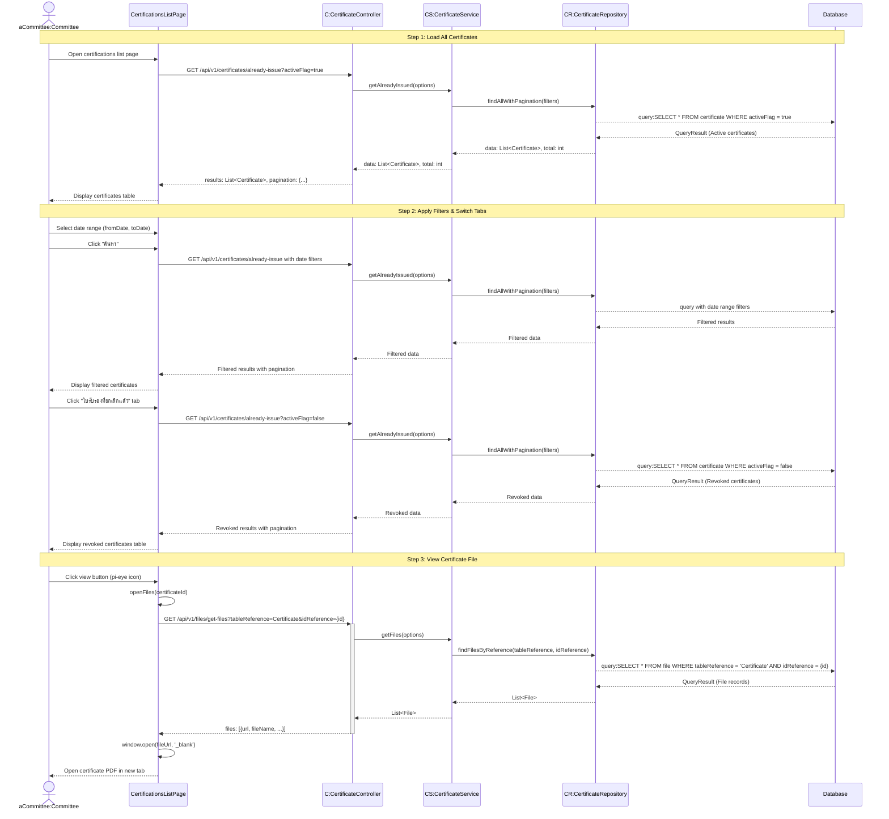

# Committee Certifications List - Sequence Diagram (High-Level)

## High-Level Overview

### Main Flow

1. **Load All Certificates** - คณะกรรมการเข้าสู่หน้ารายการใบรับรอง ระบบโหลดใบรับรองทั้งหมด (เริ่มต้นด้วยใบรับรองที่ใช้งานอยู่)
2. **Apply Filters & Switch Tabs** - กรองตามช่วงวันที่ และสลับแท็บระหว่าง "ใช้งานอยู่" และ "ยกเลิกแล้ว"
3. **View Certificate File** - ดูไฟล์ใบรับรอง PDF

### Key Components

- **CertificationsListPage** - UI component สำหรับแสดงรายการใบรับรองทั้งหมด
- **useAlreadyIssuedCertificates Hook** - จัดการ state และ business logic สำหรับการดึงและแสดงข้อมูล
- **CertificateController** - จัดการ request/response สำหรับการดึงรายการใบรับรอง
- **CertificateService** - Business logic สำหรับการดึงข้อมูลใบรับรอง
- **CertificateRepository** - Data access layer สำหรับ query ข้อมูลใบรับรอง

### Features

- Tab switching ระหว่าง "ใบรับรองที่ใช้งานอยู่" (activeFlag=true) และ "ใบรับรองที่ยกเลิกแล้ว" (activeFlag=false)
- Date range filter (fromDate, toDate) สำหรับกรองตามวันที่มีผลและวันที่หมดอายุ
- Pagination และ Multi-sort สำหรับรายการใบรับรอง
- View certificate PDF file (เฉพาะแท็บ "ใช้งานอยู่")
- Real-time data fetching with loading state
- Session-based authorization (COMMITTEE or ADMIN)

### Step Details

#### Step 1: Load Certificates

- แสดงตารางใบรับรองทั้งหมด
- เริ่มต้นที่แท็บ "ใบรับรองที่ใช้งานอยู่" (activeFlag=true)
- แสดงข้อมูล:
  - รหัสใบรับรอง (certificateId)
  - รหัสการตรวจ (inspection.inspectionNo)
  - วันที่ตรวจ (inspection.inspectionDateAndTime)
  - สถานที่ (rubberFarm: หมู่บ้าน, ตำบล, อำเภอ, จังหวัด)
  - วันที่มีผล (effectiveDate)
  - วันที่หมดอายุ (expiryDate)
  - Actions: ปุ่มดูไฟล์ (เฉพาะใบรับรองที่ใช้งานอยู่)
- Pagination: 10, 25, 50 rows per page
- Multi-sort support
- Initial load with default filters

#### Step 2: Filter & Tab Operations

**Date Range Filtering:**

- เลือก fromDate (วันที่มีผล - ตั้งแต่)
- เลือก toDate (วันที่หมดอายุ - ถึง)
- คลิก "ค้นหา" → Apply filters
- คลิก "ล้างค่า" → Clear filters and reload

**Tab Switching:**

- แท็บ "ใบรับรองที่ใช้งานอยู่" (In-Use)
  - Filter: activeFlag = true
  - แสดงใบรับรองที่ยังใช้งานได้
  - แสดงปุ่มดูไฟล์
- แท็บ "ใบรับรองที่ยกเลิกแล้ว" (Not In-Use)
  - Filter: activeFlag = false
  - แสดงใบรับรองที่ยกเลิกแล้ว
  - ไม่แสดงปุ่ม actions

**Sort Operations:**

- Multi-sort ทุกคอลัมน์ที่มี sortable=true
- Click column header → Toggle sort (asc/desc)
- Hold shift + click → Multi-sort

#### Step 3: View Certificate File

- คลิกปุ่มดูไฟล์ (pi-eye icon)
- เฉพาะในแท็บ "ใช้งานอยู่" เท่านั้น
- Fetch file URL จาก File API
- เปิดไฟล์ PDF ในแท็บใหม่
- หากไม่พบไฟล์ → แสดง error toast

### Data Structure

- **Certificate** - ใบรับรองแหล่งผลิต

  - certificateId (PK)
  - inspectionId (FK)
  - effectiveDate (date)
  - expiryDate (date)
  - activeFlag (boolean)
  - cancelRequestFlag (boolean)
  - cancelRequestDetail (string, optional)
  - version (int) - optimistic locking
  - createdAt (timestamp)
  - updatedAt (timestamp)

- **Relations:**
  - Certificate → Inspection (1:1)
  - Inspection → RubberFarm (N:1)
  - Inspection → Auditor (N:1)
  - Certificate → CommitteeCertificate (1:N)

### Filter Logic

- **Date Range Filter:**

  - fromDate: effectiveDate >= fromDate
  - toDate: expiryDate <= toDate
  - Both can be used together or independently

- **Tab Filter:**
  - activeFlag = true: ใบรับรองที่ใช้งานอยู่
  - activeFlag = false: ใบรับรองที่ยกเลิกแล้ว

### Pagination & Sorting

- **Pagination:**

  - Default: 10 rows per page
  - Options: 10, 25, 50 rows
  - Lazy loading (server-side pagination)
  - Parameters: limit, offset

- **Sorting:**
  - Multi-sort support (sortMode="multiple")
  - sortField: field name to sort
  - sortOrder: asc (1) or desc (-1)
  - multiSortMeta: array of {field, order} for multi-column sort
  - Nested field support: inspection.inspectionNo, inspection.rubberFarm.villageName

### Success Flow

- Load certificates list successfully
- Apply filters and see filtered results
- Switch tabs and see different certificate states
- View certificate PDF in new browser tab
- Navigate through pages with pagination
- Sort by multiple columns

### Error Handling

- Unauthorized → 401/403 redirect to login
- Failed to fetch certificates → Show empty table with error console log
- No files found → Show error toast "ไม่พบไฟล์สำหรับใบรับรองนี้"
- File API error → Show error toast "เกิดข้อผิดพลาดขณะดึงไฟล์"
- Invalid date range → No validation (flexible filtering)

### Integration Points

- **Certificate API** - GET /api/v1/certificates/already-issue
  - Query parameters: limit, offset, activeFlag, fromDate, toDate, sortField, sortOrder, multiSortMeta
  - Returns: results array and pagination info
- **File API** - GET /api/v1/files/get-files
  - Query parameters: tableReference="Certificate", idReference={certificateId}
  - Returns: files array with url, fileName, etc.
- **NextAuth Session** - Authorization check for COMMITTEE or ADMIN role

### Hook State Management

`useAlreadyIssuedCertificates` manages:

- **items** - Certificate list data
- **loading** - Loading state
- **totalRecords** - Total count for pagination
- **lazyParams** - Pagination and sorting parameters
- **fromDate/toDate** - Date filter UI state
- **appliedFromDate/appliedToDate** - Active date filters
- **activeFlag/appliedActiveFlag** - Tab state and active filter
- **currentTab** - Computed tab identifier (in-use, not-in-use)

### Authorization

- Required roles: COMMITTEE or ADMIN
- Session-based authentication via NextAuth
- Unauthorized users redirected to home page
- All certificate records visible to authorized users
- No row-level security (all committees see all certificates)

### Use Cases

1. **ดูภาพรวมใบรับรองทั้งหมด** - View all certificates in the system

   - Committee opens list page
   - See all active certificates by default
   - Understand overall certification status

2. **ค้นหาใบรับรองในช่วงเวลาที่กำหนด** - Search certificates by date range

   - Committee selects date range
   - Apply filters to narrow down results
   - Find specific certificates issued/expiring in a time period

3. **ตรวจสอบใบรับรองที่ยกเลิก** - Review revoked certificates

   - Committee switches to "ยกเลิกแล้ว" tab
   - See all revoked certificates
   - Understand cancellation history

4. **ดูไฟล์ใบรับรอง** - View certificate document
   - Committee clicks eye icon on certificate row
   - PDF opens in new tab
   - Review actual certificate document

### Business Logic

- Certificates are listed for all farmers (system-wide view)
- Active certificates (activeFlag=true) are currently valid
- Revoked certificates (activeFlag=false) are historical records
- Only active certificates show file viewing action
- Date filters apply to effectiveDate and expiryDate
- Pagination is server-side for performance with large datasets
- Multi-sort allows complex sorting scenarios
- File viewing is available only for records with uploaded files

### UI Behavior

- Initial load shows "ใช้งานอยู่" tab (activeFlag=true)
- Date filters persist until explicitly cleared
- Tab switching resets pagination to first page
- Applying filters resets pagination to first page
- Clear filters resets both dates and pagination
- Loading state shows during data fetching
- Actions column only visible in "ใช้งานอยู่" tab
- Responsive grid layout for date filters
- Toast notifications for file viewing errors

### Performance Considerations

- Lazy loading (server-side pagination) for large datasets
- Date filters reduce query scope
- Multi-sort processed on server-side
- File URLs fetched on-demand (not with certificate list)
- Pagination state managed efficiently with useCallback
- Minimal re-renders with useMemo for columns
