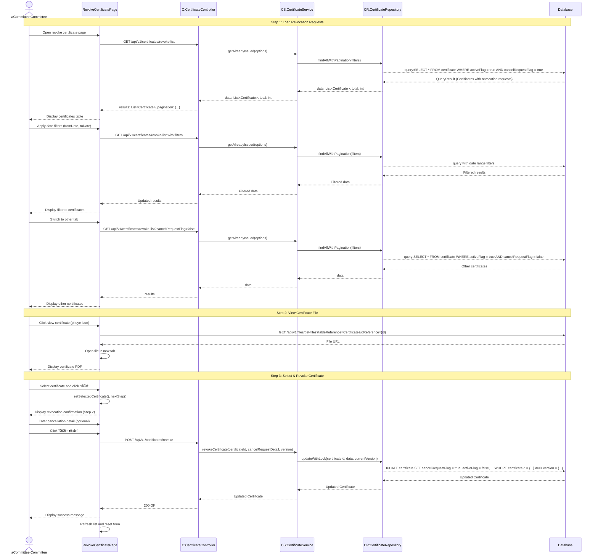

# Committee Certifications Revoke - Sequence Diagram (High-Level)

## High-Level Overview

### Main Flow

1. **Load Revocation Requests** - คณะกรรมการเข้าสู่หน้ายกเลิกใบรับรอง ระบบโหลดรายการใบรับรองที่มีคำขอยกเลิก
2. **View Certificate File** - ดูไฟล์ใบรับรอง PDF
3. **Select & Revoke Certificate** - เลือกใบรับรองและยืนยันการยกเลิก

### Key Components

- **RevokeCertificatePage** - UI component สำหรับยกเลิกใบรับรอง (2-step process)
- **CertificateController** - จัดการ request/response สำหรับการยกเลิกใบรับรอง
- **CertificateService** - Business logic สำหรับการยกเลิกใบรับรอง
- **CertificateRepository** - Data access layer สำหรับอัปเดตสถานะใบรับรอง

### Features

- Tab switching ระหว่าง "คำขอยกเลิก" (cancelRequestFlag=true) และ "อื่นๆ" (cancelRequestFlag=false)
- Pagination และ Multi-sort สำหรับรายการใบรับรอง
- Date range filter (fromDate, toDate) สำหรับกรองใบรับรอง
- 2-step wizard พร้อม step indicator
- View certificate PDF file
- Optional cancellation detail text
- Optimistic Locking สำหรับ update
- Session-based authorization

### Step Details

#### Step 1: Select Certificate to Revoke

- แสดงตารางใบรับรองที่มีคำขอยกเลิก
- Tab 1: "คำขอยกเลิก" (activeFlag=true, cancelRequestFlag=true)
  - ใบรับรองที่เกษตรกรยื่นขอยกเลิกแล้ว
  - รอคณะกรรมการอนุมัติ
- Tab 2: "อื่นๆ" (activeFlag=true, cancelRequestFlag=false)
  - ใบรับรองที่ยังใช้งานอยู่ แต่ไม่มีคำขอยกเลิก
  - คณะกรรมการสามารถยกเลิกได้โดยตรง
- แสดงข้อมูล: รหัสใบรับรอง, รหัสการตรวจ, วันที่ตรวจ, สถานที่, วันที่มีผล, วันที่หมดอายุ
- ปุ่มดูไฟล์ใบรับรอง (pi-eye icon)
- Date range filter (fromDate, toDate)
- Pagination: 10, 25, 50 rows per page
- Multi-sort support
- Select certificate → Next

#### Step 2: Confirm Revocation

- แสดงข้อมูลใบรับรองที่เลือก
- กรอก cancellation detail (optional)
  - แสดงรายละเอียดการขอยกเลิกจากเกษตรกร (ถ้ามี)
  - คณะกรรมการสามารถเพิ่มหมายเหตุเพิ่มเติม
- ยืนยันการยกเลิก → Revoke certificate

### Data Structure

- **Certificate** - ใบรับรองแหล่งผลิต
  - certificateId (PK)
  - inspectionId (unique FK)
  - effectiveDate (Date)
  - expiryDate (Date)
  - activeFlag (boolean) - สถานะใช้งาน
  - cancelRequestFlag (boolean) - สถานะมีคำขอยกเลิก
  - cancelRequestDetail (string) - รายละเอียดการยกเลิก
  - version (int) - สำหรับ optimistic locking

### Certificate States (Lifecycle)

1. **Issued** - ใบรับรองที่ใช้งานอยู่

   - activeFlag = true
   - cancelRequestFlag = false

2. **Cancel Requested** - มีคำขอยกเลิก (จากเกษตรกร)

   - activeFlag = true
   - cancelRequestFlag = true
   - cancelRequestDetail = reason from farmer

3. **Revoked** - ยกเลิกใบรับรองแล้ว (อนุมัติโดยคณะกรรมการ)
   - activeFlag = false
   - cancelRequestFlag = true
   - cancelRequestDetail = updated with committee notes

### Validation Rules

- certificateId required
- Certificate must exist and be active (activeFlag = true)
- Only COMMITTEE or ADMIN can revoke certificates
- version จำเป็นสำหรับ update เพื่อป้องกันการ update พร้อมกัน
- cancelRequestDetail optional (string, max 255 characters)

### Revocation Logic

When revoking a certificate:

1. Set `cancelRequestFlag = true` (mark as requested/revoked)
2. Set `activeFlag = false` (deactivate certificate)
3. Update `cancelRequestDetail` with committee notes (optional)
4. Update `version` for optimistic locking
5. Update `updatedAt` timestamp

### Tab Filters

- **"คำขอยกเลิก"** (revocation-requests)
  - Filter: activeFlag=true, cancelRequestFlag=true
  - แสดงใบรับรองที่เกษตรกรยื่นขอยกเลิกแล้ว
- **"อื่นๆ"** (other)
  - Filter: activeFlag=true, cancelRequestFlag=false
  - แสดงใบรับรองที่ยังใช้งานอยู่ แต่ยังไม่มีคำขอยกเลิก

### Success Flow

- แสดง success toast หลังยกเลิกใบรับรองสำเร็จ
- Refresh certificates list
- Reset selected certificate and form
- Return to step 1 (certificate selection)

### Error Handling

- Certificate not found → 404 Not Found
- Certificate already revoked → 400 Bad Request
- Optimistic lock conflict → 409 Conflict with version mismatch
- Validation errors → Show error toast
- Unauthorized → 401/403 Unauthorized

### Integration Points

- **Certificate API** - GET /api/v1/certificates/revoke-list, POST /api/v1/certificates/revoke
- **File API** - GET /api/v1/files/get-files?tableReference=Certificate&idReference={id}
- **NextAuth Session** - Authorization check for COMMITTEE or ADMIN role

### File Viewing Flow

1. User clicks view button (pi-eye icon)
2. Fetch file URL from File API with certificateId
3. Open file in new browser tab
4. Display PDF certificate

### Authorization

- Required roles: COMMITTEE or ADMIN
- Only authorized users can view revocation requests
- Only authorized users can revoke certificates
- Audit trail maintained through updatedAt timestamp

### Use Cases

1. **เกษตรกรยื่นขอยกเลิก** - Farmer requests cancellation

   - Farmer submits cancellation request with reason
   - Certificate moves to "คำขอยกเลิก" tab
   - Committee reviews and approves/rejects

2. **คณะกรรมการยกเลิกโดยตรง** - Committee direct revocation
   - Committee finds certificate in "อื่นๆ" tab
   - Committee revokes without farmer request
   - Used for expired, invalid, or problematic certificates

### Business Logic

- Revocation is permanent (cannot be undone)
- Revoked certificates maintain historical record (not deleted)
- activeFlag=false means certificate is no longer valid
- Farmer can request cancellation via their own interface
- Committee has final authority to revoke any certificate
- cancelRequestDetail stores cancellation history
