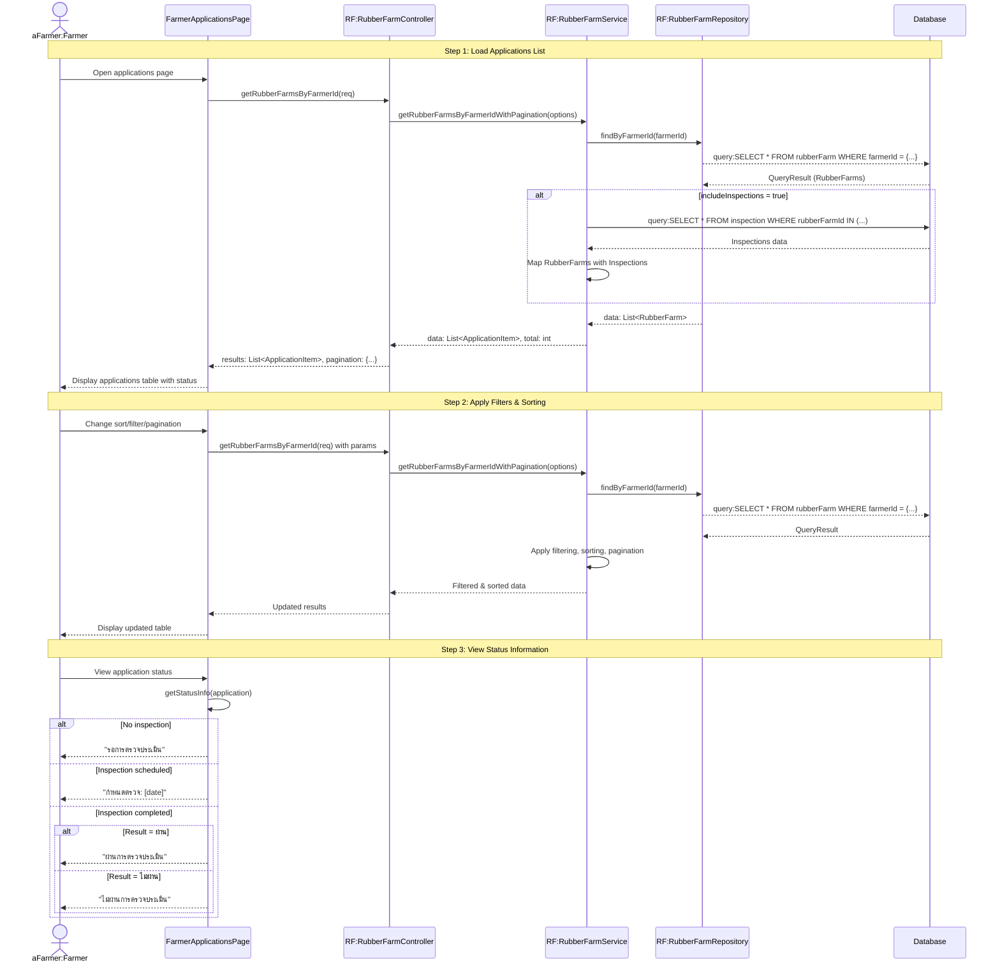

# Farmer Applications - Sequence Diagram (High-Level)

## High-Level Overview

### Main Flow

1. **Load Applications List** - เกษตรกรเข้าสู่หน้าติดตามสถานะ ระบบโหลดรายการสวนยางพร้อมข้อมูลการตรวจประเมิน
2. **Apply Filters & Sorting** - เกษตรกรสามารถเรียงลำดับและค้นหาตามเงื่อนไขต่างๆ
3. **View Status Information** - แสดงสถานะการตรวจประเมินแต่ละสวนยาง

### Key Components

- **FarmerApplicationsPage** - UI component สำหรับติดตามสถานะการรับรอง
- **RubberFarmController** - จัดการ request/response สำหรับข้อมูลสวนยาง
- **RubberFarmService** - Business logic สำหรับการดึงข้อมูลสวนยางพร้อม inspection
- **RubberFarmRepository** - Data access layer สำหรับข้อมูลสวนยาง

### Features

- Pagination และ Multi-sort สำหรับรายการคำขอ
- แสดงข้อมูลสวนยาง (รหัส, สถานที่, จังหวัด, อำเภอ, ตำบล)
- แสดงวันที่นัดตรวจประเมิน
- แสดงสถานะการตรวจประเมิน (รอตรวจ, กำหนดตรวจ, ผ่าน, ไม่ผ่าน)
- Integration กับ Inspection data เพื่อแสดงสถานะที่แม่นยำ
- Lazy loading สำหรับประสิทธิภาพ

### Application Status Flow

1. **รอการตรวจประเมิน** - สวนยางที่ยังไม่มีการตรวจ (No inspection)
2. **กำหนดตรวจ** - มีการนัดหมายตรวจประเมินแล้ว (Inspection scheduled)
3. **ตรวจประเมินแล้ว** - การตรวจเสร็จสิ้น
   - **ผ่านการตรวจประเมิน** - Result = "ผ่าน"
   - **ไม่ผ่านการตรวจประเมิน** - Result = "ไม่ผ่าน"

### Data Structure

- **ApplicationItem** = RubberFarm + Inspection (optional)
- Each rubber farm can have 0 or 1 inspection record
- Status determined by inspection existence and result

### Sorting & Filtering Options

- Sort by: rubberFarmId, location, province, district, subDistrict, inspectionDateAndTime
- Multi-sort support
- Pagination: 10, 25, 50 rows per page
- Province/District/SubDistrict filtering (implemented in service layer)

### Empty State

- แสดงข้อความแนะนำให้ยื่นขอรับรองแหล่งผลิต
- ลิงก์ไปยังหน้าลงทะเบียนสวนยางใหม่
