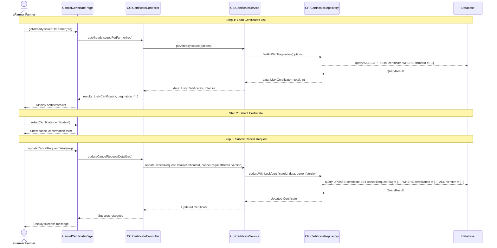

# Farmer Applications Cancel - Sequence Diagram (High-Level)

## High-Level Overview

### Main Flow

1. **Load Certificates List** - เกษตรกรเข้าสู่หน้ายกเลิกใบรับรอง ระบบจะโหลดรายการใบรับรองที่ออกให้เกษตรกรแล้ว
2. **Select Certificate** - เกษตรกรเลือกใบรับรองที่ต้องการยกเลิก และกรอกเหตุผลการยกเลิก
3. **Submit Cancel Request** - เกษตรกรส่งคำขอยกเลิก ระบบอัปเดตสถานะใบรับรองพร้อม optimistic locking

### Key Components

- **CancelCertificatePage** - UI component สำหรับการยกเลิกใบรับรอง
- **CertificateController** - จัดการ request/response สำหรับข้อมูลใบรับรอง
- **CertificateService** - Business logic ของการจัดการใบรับรอง
- **CertificateRepository** - Data access layer สำหรับใบรับรอง

### Features

- Pagination และ Sorting สำหรับรายการใบรับรอง
- Filter ตามวันที่ (fromDate, toDate)
- Tab switching ระหว่างใบรับรองที่ใช้งานอยู่ และที่ยื่นขอยกเลิกแล้ว
- Optimistic Locking เพื่อป้องกันการ update พร้อมกัน
- แสดงข้อมูลการตรวจสอบและสถานที่สวนยางที่เกี่ยวข้อง

### Certificate States

- **In-Use** (activeFlag=true, cancelRequestFlag=false) - ใบรับรองที่ใช้งานอยู่
- **Cancel Requested** (cancelRequestFlag=true, activeFlag=true) - ยื่นขอยกเลิกแล้ว
- **Cancelled** (cancelRequestFlag=true, activeFlag=false) - ยกเลิกใบรับรองแล้ว
