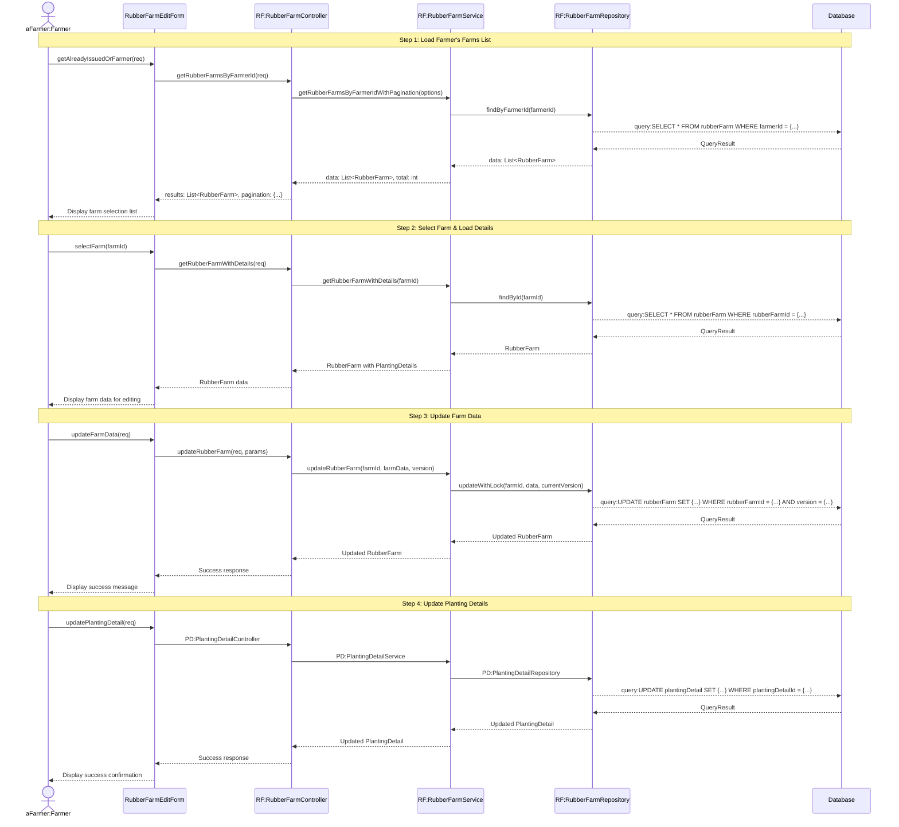

# Farmer Applications Edit - Sequence Diagram (High-Level)

## High-Level Overview

### Main Flow

1. **Load Farmer's Farms** - เกษตรกรเข้าสู่หน้าแก้ไข ระบบจะโหลดรายการสวนยางทั้งหมดของเกษตรกร
2. **Select Farm** - เกษตรกรเลือกสวนยางที่ต้องการแก้ไข ระบบโหลดข้อมูลสวนยางพร้อมรายละเอียดการปลูก
3. **Update Farm Data** - เกษตรกรแก้ไขข้อมูลสวนยาง (ที่อยู่, พิกัด, ฯลฯ) ระบบอัปเดตข้อมูลพร้อม optimistic locking
4. **Update Planting Details** - เกษตรกรแก้ไขรายละเอียดการปลูก (พันธุ์ยาง, พื้นที่, จำนวนต้น, ฯลฯ) ระบบอัปเดตข้อมูล

### Key Components

- **RubberFarmEditForm** - UI component สำหรับแก้ไขข้อมูลสวนยาง
- **RubberFarmController** - จัดการ request/response สำหรับข้อมูลสวนยาง
- **RubberFarmService** - Business logic ของการจัดการสวนยาง
- **RubberFarmRepository** - Data access layer สำหรับสวนยาง
- **PlantingDetail Components** - จัดการข้อมูลรายละเอียดการปลูกแยกต่างหาก

### Features

- Pagination และ Sorting สำหรับรายการสวนยาง
- Optimistic Locking เพื่อป้องกันการ update พร้อมกัน
- แยก update ระหว่าง RubberFarm และ PlantingDetail
- แสดงข้อมูลที่อยู่แบบ 3 level (จังหวัด, อำเภอ, ตำบล)
