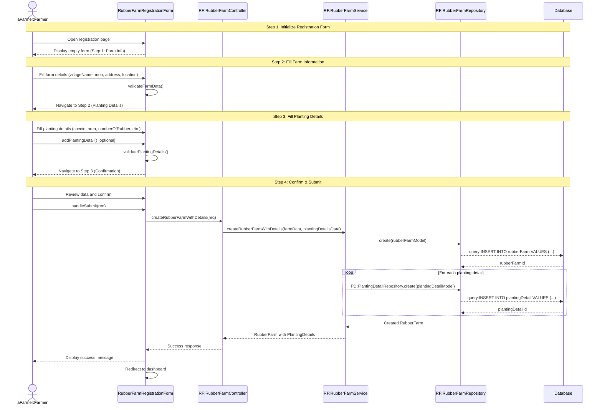

# Farmer Applications New - Sequence Diagram (High-Level)

## High-Level Overview

### Main Flow

1. **Initialize Registration Form** - เกษตรกรเข้าสู่หน้าลงทะเบียนสวนยางใหม่
2. **Fill Farm Information** - กรอกข้อมูลพื้นฐานของสวนยาง (ที่อยู่, พิกัด) และตรวจสอบความถูกต้อง
3. **Fill Planting Details** - กรอกรายละเอียดการปลูก (พันธุ์ยาง, พื้นที่, จำนวนต้น) สามารถเพิ่มหลายรายการได้
4. **Confirm & Submit** - ตรวจสอบข้อมูลและยืนยันการส่ง ระบบจะสร้างสวนยางพร้อมรายละเอียดการปลูกทั้งหมด

### Key Components

- **RubberFarmRegistrationForm** - UI component สำหรับลงทะเบียนสวนยางใหม่
- **RubberFarmController** - จัดการ request/response สำหรับการสร้างสวนยาง
- **RubberFarmService** - Business logic สำหรับการสร้างสวนยางพร้อมรายละเอียด
- **RubberFarmRepository** - Data access layer สำหรับบันทึกข้อมูลสวนยาง
- **PlantingDetailRepository** - Data access layer สำหรับบันทึกรายละเอียดการปลูก

### Features

- Multi-step form (3 steps) พร้อม progress indicator
- Validation แบบ step-by-step ก่อนไปขั้นตอนถัดไป
- Interactive map สำหรับระบุตำแหน่งสวนยาง
- รองรับการเพิ่มรายละเอียดการปลูกหลายรายการ
- Address selection แบบ 3 level (จังหวัด, อำเภอ, ตำบล)
- Confirmation step พร้อม checkbox ยืนยันความถูกต้อง
- Transaction-based creation (สร้าง RubberFarm และ PlantingDetails พร้อมกัน)

### Form Steps

1. **Step 1: Farm Information** - ข้อมูลสวนยาง (villageName, moo, address, location on map)
2. **Step 2: Planting Details** - รายละเอียดการปลูก (specie, areaOfPlot, numberOfRubber, numberOfTapping, ageOfRubber, yearOfTapping, monthOfTapping, totalProduction)
3. **Step 3: Confirmation** - ยืนยันข้อมูลทั้งหมดก่อนส่ง

### Validation Rules

- Farm data: villageName, moo, subDistrict, district, province, location (not [0,0])
- Planting details: ต้องมีอย่างน้อย 1 รายการ และทุกฟิลด์ต้องถูกต้อง
- Must confirm checkbox before submit
