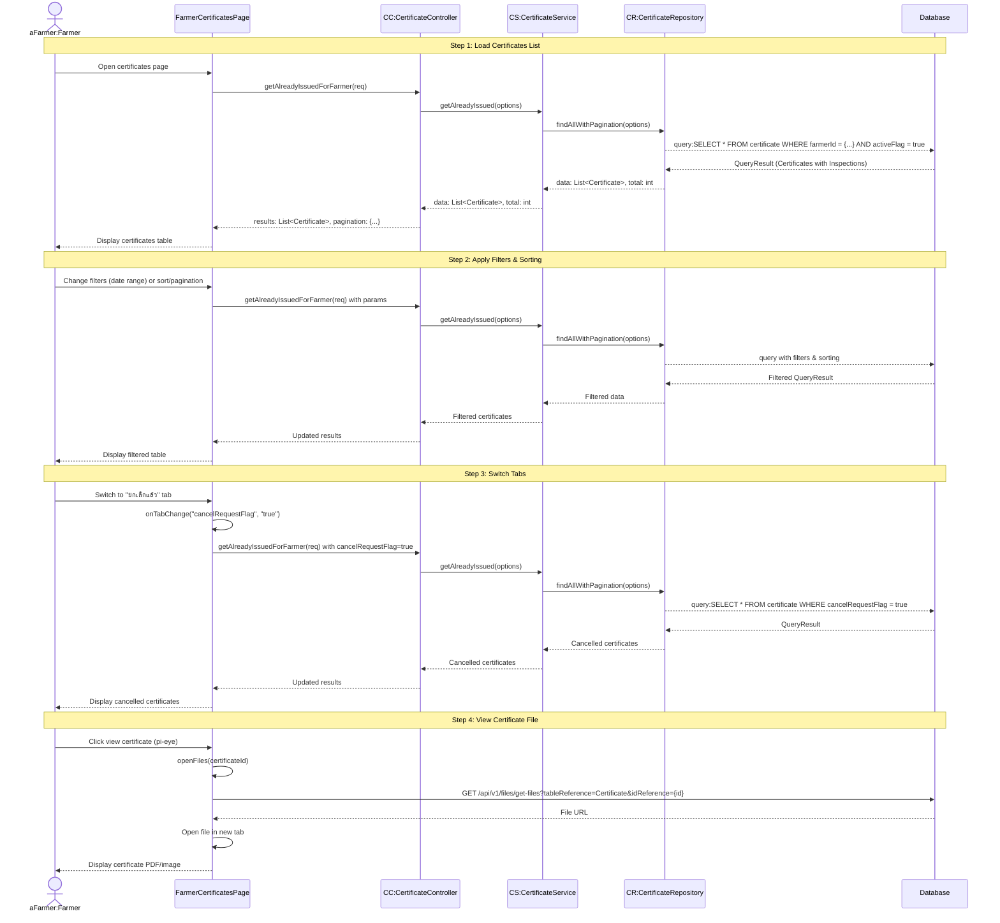

# Farmer Certificates - Sequence Diagram (High-Level)

## High-Level Overview

### Main Flow

1. **Load Certificates List** - เกษตรกรเข้าสู่หน้าใบรับรอง ระบบโหลดรายการใบรับรองที่ได้รับ
2. **Apply Filters & Sorting** - เกษตรกรสามารถกรองตามช่วงวันที่และเรียงลำดับข้อมูล
3. **Switch Tabs** - สลับระหว่าง "ใบรับรองที่ใช้งานอยู่" และ "ยกเลิกแล้ว"
4. **View Certificate File** - เปิดดูไฟล์ใบรับรอง (PDF/image)

### Key Components

- **FarmerCertificatesPage** - UI component สำหรับแสดงใบรับรองของเกษตรกร
- **CertificateController** - จัดการ request/response สำหรับข้อมูลใบรับรอง
- **CertificateService** - Business logic สำหรับการจัดการใบรับรอง
- **CertificateRepository** - Data access layer สำหรับข้อมูลใบรับรอง

### Features

- Pagination และ Multi-sort สำหรับรายการใบรับรอง
- Date range filter (fromDate, toDate)
- Tab switching ระหว่างใบรับรองที่ใช้งานอยู่ (activeFlag=true, cancelRequestFlag=false) และที่ยกเลิกแล้ว (cancelRequestFlag=true)
- แสดงข้อมูล: รหัสใบรับรอง, รหัสการตรวจ, วันที่ตรวจ, สถานที่, วันที่มีผล, วันที่หมดอายุ
- ดูไฟล์ใบรับรองผ่าน File API
- Lazy loading สำหรับประสิทธิภาพ

### Certificate Display Modes

1. **Tab: "ใช้งานอยู่"** (activeFlag=true, cancelRequestFlag=false)
   - แสดงปุ่มดูไฟล์ใบรับรอง (pi-eye icon)
   - ใบรับรองที่มีผลใช้งาน
2. **Tab: "ยกเลิกแล้ว"** (cancelRequestFlag=true)
   - แสดงสถานะการยกเลิก:
     - "ยื่นขอยกเลิกแล้ว" (cancelRequestFlag=true, activeFlag=true)
     - "ยกเลิกใบรับรองแล้ว" (cancelRequestFlag=true, activeFlag=false)

### Data Integration

- **Certificate** - ข้อมูลใบรับรอง (certificateId, effectiveDate, expiryDate, activeFlag, cancelRequestFlag)
- **Inspection** - ข้อมูลการตรวจ (inspectionNo, inspectionDateAndTime)
- **RubberFarm** - ข้อมูลสวนยาง (villageName, district, province)
- **File** - ไฟล์ใบรับรอง (PDF/image)

### Certificate Lifecycle

1. **Issued** - ใบรับรองออกใหม่ (activeFlag=true, cancelRequestFlag=false)
2. **Cancel Requested** - ยื่นขอยกเลิก (activeFlag=true, cancelRequestFlag=true)
3. **Cancelled** - ยกเลิกแล้ว (activeFlag=false, cancelRequestFlag=true)

### Sorting & Filtering Options

- Sort by: certificateId, inspectionNo, inspectionDateAndTime, location, effectiveDate, expiryDate
- Multi-sort support
- Date range filter: fromDate - toDate (filter by effectiveDate and expiryDate)
- Pagination: 10, 25, 50 rows per page
- Tab filter: activeFlag + cancelRequestFlag combinations
