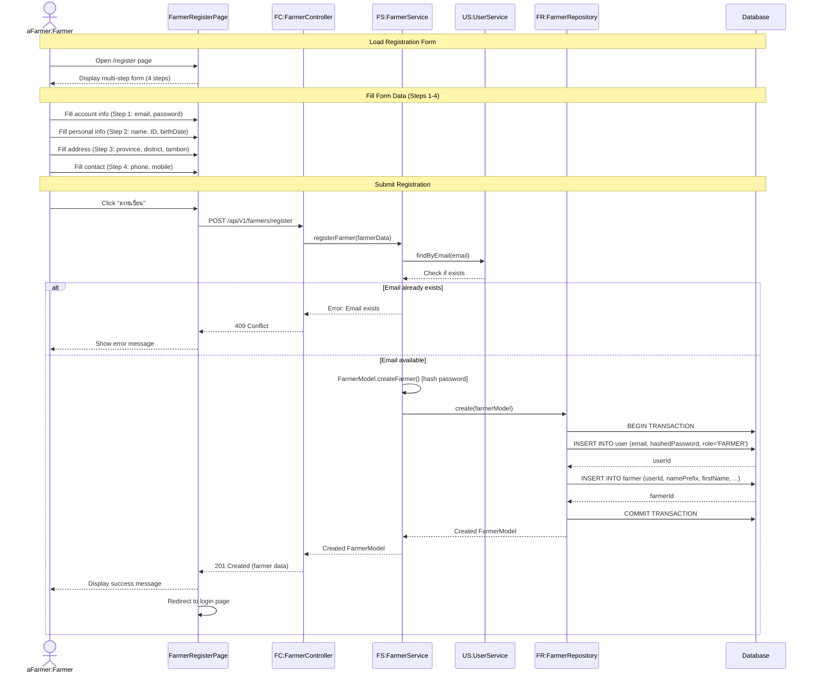

# Farmer Register - Sequence Diagram (High-Level)

## High-Level Overview

### Main Flow

1. **Load Registration Form** - เปิดหน้าลงทะเบียนแบบ multi-step (4 steps)
2. **Fill Form Data** - กรอกข้อมูลทั้ง 4 steps (Account, Personal, Address, Contact)
3. **Submit Registration** - ส่งข้อมูลลงทะเบียนและสร้าง User + Farmer

### Key Components

- **FarmerRegisterPage** - UI component สำหรับฟอร์มลงทะเบียนเกษตรกร (4 steps)
- **FarmerController** - จัดการ request/response สำหรับการลงทะเบียน
- **FarmerService** - Business logic สำหรับการสร้างเกษตรกร และตรวจสอบความซ้ำซ้อน
- **UserService** - จัดการข้อมูล User (check email duplication)
- **FarmerRepository** - Data access layer สำหรับบันทึกข้อมูล User และ Farmer

### Features

- Multi-step form (4 steps) พร้อม step progress indicator
- Validation แบบ step-by-step ก่อนไปขั้นตอนถัดไป
- Real-time validation (email format, password strength, ID number format)
- Password hashing ด้วย bcrypt (10 rounds)
- Address selection แบบ 3 level (จังหวัด → อำเภอ → ตำบล)
- Auto-fill zipCode เมื่อเลือกตำบล
- Responsive design (Desktop + Mobile layouts)
- Transaction-based creation (สร้าง User และ Farmer พร้อมกันใน 1 transaction)
- Email duplication check

### Form Steps

1. **Step 1: Account Information** - ข้อมูลบัญชีผู้ใช้

   - Email (unique)
   - Password (min 8 characters)
   - Confirm Password (must match)

2. **Step 2: Personal Information** - ข้อมูลส่วนตัว

   - Name Prefix (คำนำหน้า: นาย/นาง/นางสาว)
   - First Name & Last Name
   - Identification Number (เลขบัตรประชาชน 13 หลัก)
   - Birth Date
   - Gender (ชาย/หญิง/ไม่ระบุ)

3. **Step 3: Address Information** - ข้อมูลที่อยู่

   - House Number, Village Name, Moo
   - Road, Alley
   - Province → Amphure → Tambon (cascading dropdowns)
   - Zip Code (auto-fill)

4. **Step 4: Contact Information** - ข้อมูลการติดต่อ
   - Phone Number (optional)
   - Mobile Phone Number (required)

### Validation Rules

- **Email**: Required, must contain @
- **Password**: Required, min 8 characters
- **Confirm Password**: Must match password
- **Identification Number**: Required, 13 digits
- **Name fields**: Required
- **Address**: Province, Amphure, Tambon required
- **Mobile Phone**: Required

### Database Transaction

- Create User record first (userId generated)
- Create Farmer record linked to User (farmerId generated)
- Both operations in single transaction (ACID compliance)
- Rollback if any operation fails

### Error Handling

- Email already exists → 409 Conflict
- Invalid data → 400 Bad Request
- Validation errors → Show error messages on specific fields
- Transaction failure → Rollback and show error

### Success Flow

- Display success message
- Redirect to login page after 2 seconds
- User can login with newly created credentials
