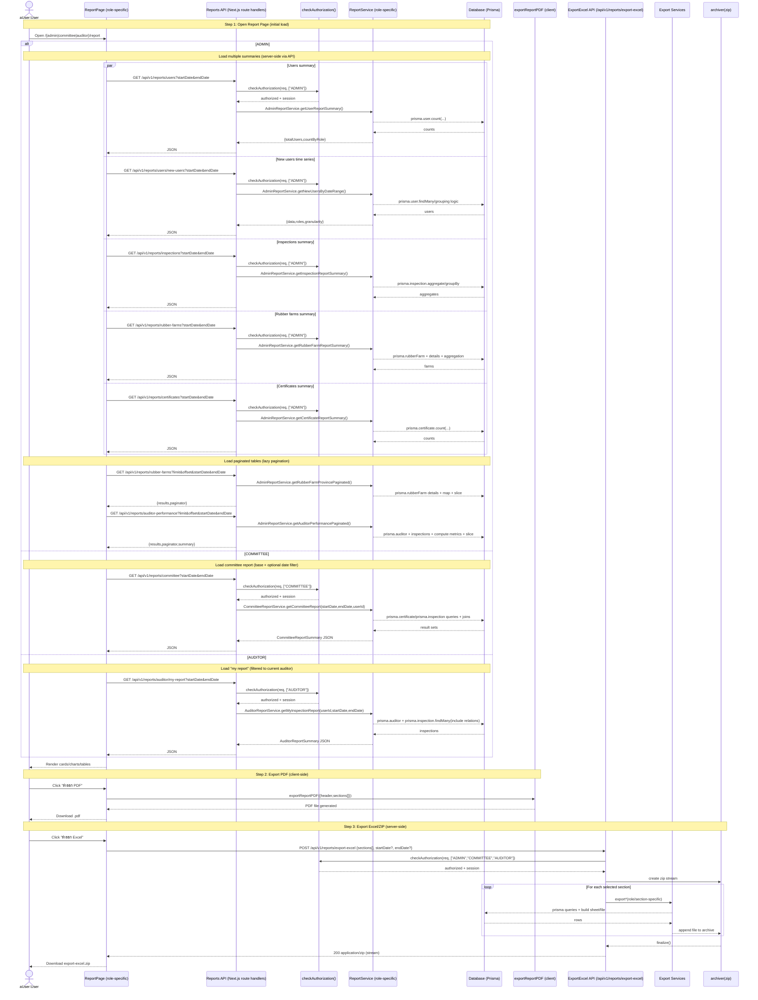

# Report (Admin / Committee / Auditor) - Sequence Diagram (High-Level)

## High-Level Overview

### Main Flow

1. **Open Report Page** - เปิดหน้ารายงานตาม role (ADMIN / COMMITTEE / AUDITOR)
2. **Load Report Data** - UI ยิง `GET /api/v1/reports/*` เพื่อดึง summary แล้วแสดงผลเป็น cards/charts/tables
3. **Filter by Date** - เลือกช่วงวันที่ → UI ยิง `GET` พร้อม `startDate/endDate` เพื่อคำนวณใหม่
4. **Export PDF** - รวม section ที่เลือกแล้ว export PDF แบบ client-side (จับ DOM + charts)
5. **Export Excel/ZIP** - ส่ง section ที่เลือกไป `POST /api/v1/reports/export-excel` แล้วดาวน์โหลดไฟล์ `.zip`

### Key Components

- `src/app/admin/report/page.tsx` - หน้า report ของ Admin (หลาย endpoint + pagination tables)
- `src/app/committee/report/page.tsx` - หน้า report ของ Committee (base report + chart refresh ตามช่วงวันที่)
- `src/app/auditor/report/page.tsx` - หน้า report ของ Auditor (my report)
- `src/app/api/v1/reports/*/route.ts` - route handlers ตรวจ role ด้วย `checkAuthorization()` แล้วเรียก service
- `src/services/AdminReportService.ts`, `src/services/CommitteeReportService.ts`, `src/services/AuditorReportService.ts` - สร้าง report summary ด้วย Prisma
- `src/app/api/v1/reports/export-excel/route.ts` + `src/services/export/*.ts` - export excel/zip ตาม section และสิทธิ์
- `src/lib/pdf/exportReportPDF.ts`, `src/lib/pdf/chartResize.ts` - export PDF จาก UI sections

### Endpoints Used By These Pages

- **Admin**
  - `GET /api/v1/reports/users?startDate&endDate`
  - `GET /api/v1/reports/users/new-users?startDate&endDate`
  - `GET /api/v1/reports/inspections?startDate&endDate`
  - `GET /api/v1/reports/rubber-farms?startDate&endDate`
  - `GET /api/v1/reports/rubber-farms?limit&offset&startDate&endDate` (pagination)
  - `GET /api/v1/reports/certificates?startDate&endDate`
  - `GET /api/v1/reports/auditor-performance?limit&offset&startDate&endDate` (pagination)
  - `POST /api/v1/reports/export-excel`

- **Committee**
  - `GET /api/v1/reports/committee?startDate&endDate`
  - `POST /api/v1/reports/export-excel`

- **Auditor**
  - `GET /api/v1/reports/auditor/my-report?startDate&endDate`
  - `POST /api/v1/reports/export-excel`
