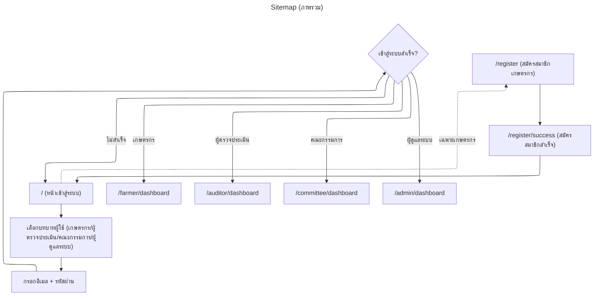
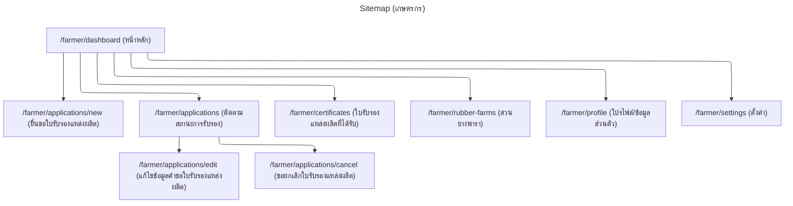
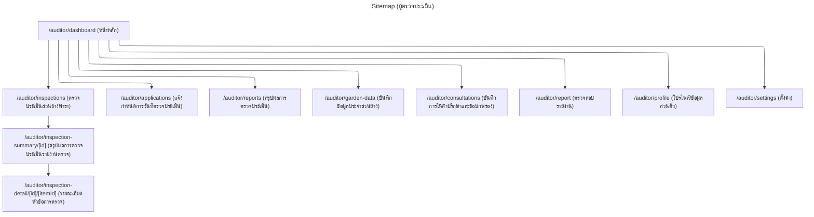
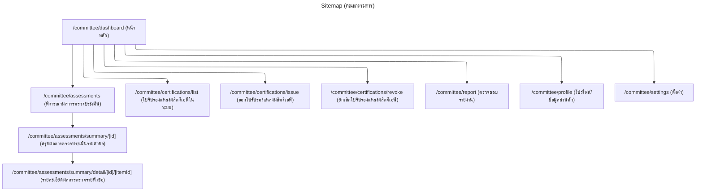
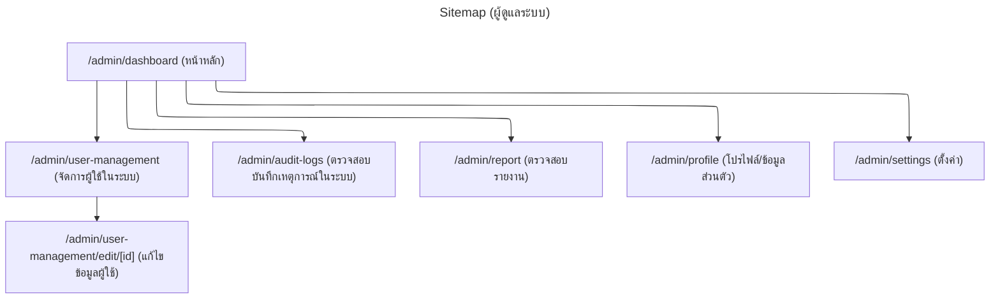
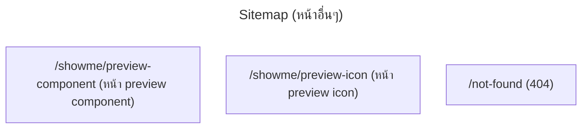

# แผนผังเว็บไซต์ (Sitemap)

เอกสารนี้สรุปหน้าเว็บ (routes) ของระบบ **GAP-IS-WA** ตามโครงสร้าง Next.js App Router ใน `src/app` และเมนูที่กำหนดใน `src/config/navItems.tsx` (อัปเดต: 2026-02-01)

> หมายเหตุ: เส้นทางที่ขึ้นต้นด้วย `/farmer`, `/auditor`, `/committee`, `/admin` ถูกป้องกันด้วย NextAuth middleware ใน `src/middleware.ts` (ต้องเข้าสู่ระบบ และ role ต้องตรง)

## ภาพรวม (Public → Role)

## Sitemap สำหรับเกษตรกร (FARMER)

## Sitemap สำหรับผู้ตรวจประเมิน (AUDITOR)

## Sitemap สำหรับคณะกรรมการ (COMMITTEE)

## Sitemap สำหรับผู้ดูแลระบบ (ADMIN)

## หน้าอื่นๆ (ภายใน/สำหรับพัฒนา)

